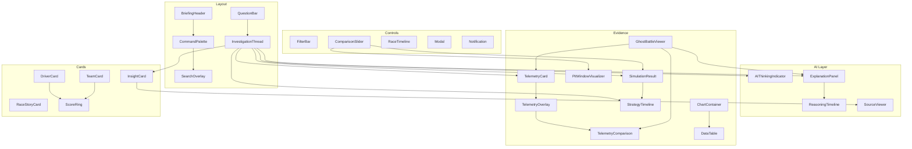

# FrontWing Component Library

> **Version**: 2.0.0
> **Role**: Staff Frontend Architect — Component Architecture Specification
> **Scope**: Every reusable component in the FrontWing UI. No code. Pure architecture.
> **Constraint**: All components conform to `design_system.md` tokens (4px spacing, `#090A0C` canvas, `#0E1013` panels, 1px `#1C2025` borders, `4px` radius, `Outfit`/`Inter` + `JetBrains Mono`, `cubic-bezier(0.16, 1, 0.3, 1)` easing).

---

## 1. Navigation — `BriefingHeader`

**Purpose**: Top-level persistent bar providing breadcrumb context, global search trigger, and session state. Replaces traditional sidebar navigation.

**Inputs**:
- `breadcrumbs: Array<{label: string, href: string}>` — e.g. `["Home", "Austrian GP", "Sainz Strategy", "What-If Lap 20"]`
- `sessionState: "idle" | "loading" | "streaming" | "error"` — live session indicator
- `userQuery: string | null` — current active question (shown as breadcrumb tail)

**Outputs**:
- `onBreadcrumbClick(index)` — navigates back to a previous investigation context
- `onSearchTrigger()` — opens the Command Palette
- `onLogoClick()` — returns to Briefing Room

**Variants**:
- `Minimal` — Logo + single breadcrumb (Briefing Room home state)
- `Thread` — Logo + full breadcrumb trail + session indicator (active investigation)
- `Expanded` — Logo + breadcrumb + inline search bar (wide desktop >1024px)

**States**:
- `idle` — Static breadcrumb trail, muted text colors (`#8B95A5`)
- `streaming` — Pulsing DRS Cyan dot next to session indicator; breadcrumb tail shows truncated question
- `error` — Session indicator turns F1 Red; tooltip shows error summary

**Interactions**:
- Click any breadcrumb segment → navigate to that investigation depth
- Click logo → return to Briefing Room
- `Cmd/Ctrl+K` → open Command Palette
- Hover breadcrumb → underline with `#5C6470` at 80ms transition

**Accessibility**:
- `nav` landmark with `aria-label="Investigation breadcrumb"`
- Each breadcrumb is a link with `aria-current="page"` on the last item
- Session indicator has `aria-live="polite"` for screen reader updates
- All interactive elements have visible focus rings (`2px` DRS Cyan outline at `0.3` opacity)

**Animations**:
- Breadcrumb segments slide in from left on navigation (`150ms` ease)
- Session dot pulses with `cursor-pulse` keyframe when streaming
- New segments push existing ones left; removed segments fade out (`80ms`)

**Reuse Locations**: Every page (Briefing Room, Investigation Thread, Race Briefing, Strategy Playground, Ghost Battle)

**Examples**:
- `Home` → single "FrontWing" logo + search icon
- `Home → Austrian GP 2024 → Sainz Strategy → What-If Lap 20` → full trail with streaming dot

**Failure States**: If breadcrumb data fails to resolve, show `Home → [Unknown Context]` with F1 Red text and a retry icon.

**Skeleton State**: Three grey pill shapes (`80px`, `120px`, `60px`) in a row, shimmer animation.

**Loading State**: Breadcrumb text appears instantly; session dot blinks cyan while the AI processes.

**Error State**: Red-bordered session indicator with monospace error code tooltip on hover.

**Performance Considerations**: Breadcrumb array is a flat list (max 5 items). No recursive rendering. Memoize breadcrumb string comparison to prevent re-renders during streaming.

---

## 2. AI Command Bar — `QuestionBar`

**Purpose**: The primary input mechanism. Users type natural language questions to initiate or continue investigations. Positioned at the bottom of the InvestigationCanvas.

**Inputs**:
- `placeholder: string` — context-sensitive, e.g. *"Ask about any race, driver, or strategy..."*
- `suggestedQuestions: Array<string>` — AI-generated follow-up chips displayed above the bar
- `disabled: boolean` — true while AI is streaming a response
- `contextLabel: string | null` — shows active investigation context (e.g. "Austrian GP 2024")

**Outputs**:
- `onSubmit(query: string)` — fires when user presses Enter or clicks submit
- `onSuggestionClick(suggestion: string)` — fires when user clicks a follow-up chip
- `onFocus()` / `onBlur()` — for visual state management

**Variants**:
- `Hero` — Large, centered, prominent (Briefing Room home). Font size: `16px`. Height: `56px`.
- `Inline` — Compact, bottom-docked (Investigation Thread). Font size: `14px`. Height: `44px`.
- `Disabled` — Greyed out while AI is streaming. Shows "Generating response..." in placeholder.

**States**:
- `empty` — Placeholder text visible, border `#1C2025`
- `focused` — Border glows DRS Cyan at `0.15` opacity, placeholder dims
- `typing` — User text in `Outfit 14px`, character count visible if >200 chars
- `submitting` — Input clears, loading indicator appears
- `disabled` — Opacity `0.5`, cursor `not-allowed`

**Interactions**:
- Type + Enter → submit question
- Click suggestion chip → auto-fill and submit
- `Escape` → clear input and blur
- `Arrow Up/Down` → cycle through suggestion chips when focused
- `Cmd/Ctrl+K` → focus the QuestionBar (or open Command Palette if already focused)

**Accessibility**:
- `role="search"` with `aria-label="Ask the AI Race Engineer"`
- Suggestion chips are `role="option"` within an `aria-live="polite"` region
- Submit button has `aria-label="Submit question"`
- Disabled state announces "AI is generating a response" via `aria-busy="true"`

**Animations**:
- Focus border transition: `80ms` ease
- Suggestion chips slide up from below with staggered `50ms` delay each (`150ms` total)
- On submit, input text fades out while a progress shimmer replaces it

**Reuse Locations**: Briefing Room (Hero variant), Investigation Thread (Inline variant), Race Briefing (Inline)

**Examples**:
- Hero: *"Could Ferrari have won the Austrian Grand Prix?"*
- Inline after investigation: *"Now compare with Silverstone"*

**Failure States**: If the API rejects the query (ambiguous), the bar shows a red underline with inline error text: *"I found 3 races matching 'Ferrari rain'. Which one?"*

**Skeleton State**: A single horizontal bar (`100%` width, `44px` height) with shimmer gradient.

**Loading State**: Input disabled, placeholder reads *"Generating response..."* with flashing cursor.

**Error State**: Red `1px` bottom border, error message as inline text below the bar in `11px` mono.

**Performance Considerations**: Debounce suggestion chip generation to 300ms after last keystroke. Lazy-load suggestion chips only when QuestionBar is focused. Input is uncontrolled for maximum keystroke responsiveness.

---

## 3. Investigation Timeline — `InvestigationThread`

**Purpose**: The core scrollable canvas where the AI's investigation unfolds. Contains a sequence of VerdictBlocks, narrative paragraphs, EvidenceCards, and FollowUpSuggestions.

**Inputs**:
- `messages: Array<ThreadMessage>` — ordered list of AI responses, each containing text blocks and evidence card references
- `isStreaming: boolean` — whether the AI is currently generating
- `investigationId: string` — unique ID for sharing/bookmarking

**Outputs**:
- `onFollowUp(question: string)` — when user clicks a follow-up suggestion
- `onEvidenceExpand(cardId: string)` — when user expands an evidence card
- `onShareThread()` — generates a shareable URL

**Variants**:
- `Live` — Active investigation with streaming content
- `Archived` — Read-only shared thread (no QuestionBar, no follow-ups)
- `Branched` — Shows a branch indicator when the user diverged from the main investigation

**States**:
- `empty` — No messages yet; shows featured investigation or prompt
- `streaming` — Last message block is actively receiving tokens; scroll pinned to bottom
- `complete` — All messages rendered; follow-up suggestions visible
- `branched` — Visual branch indicator (thin DRS Cyan line splitting into two paths)

**Interactions**:
- Scroll naturally through the thread
- Click evidence card → expand inline
- Click follow-up → submit as new question (appends to thread)
- Right-click message → "Copy as quote" context menu
- `Cmd/Ctrl+S` → share thread

**Accessibility**:
- `role="log"` with `aria-live="polite"` for new messages
- Each message block is `role="article"` with `aria-label` describing content type
- Evidence cards are `role="region"` with `aria-expanded` state
- Keyboard navigation: `Tab` moves between interactive elements within the thread

**Animations**:
- New messages slide in from bottom with `150ms` ease
- Streaming text appears word-by-word with cursor blink
- Evidence cards fade in with `200ms` delay after the text that references them
- Scroll-to-bottom is smooth (`300ms`)

**Reuse Locations**: Investigation Thread (primary), Race Briefing (embedded mini-thread for race narrative)

**Examples**: A 5-message thread: Question → Verdict → Explanation with 2 evidence cards → Simulation card → Follow-up suggestions

**Failure States**: If a message fails to load, show a red-bordered placeholder: *"This analysis could not be loaded. [Retry]"*

**Skeleton State**: Three stacked blocks (verdict-sized, paragraph-sized, card-sized) with shimmer.

**Loading State**: Last block shows streaming cursor; previous blocks are fully rendered.

**Error State**: Connection lost banner at top: *"Connection interrupted. Reconnecting..."* with retry button.

**Performance Considerations**: Virtualize messages if thread exceeds 50 items. Lazy-render evidence card visuals (charts, canvases) only when scrolled into viewport (IntersectionObserver). Batch DOM updates during streaming to 60fps.

---

## 4. Telemetry Card — `TelemetryCard`

**Purpose**: An inline evidence card displaying a single telemetry metric visualization (speed trace, throttle map, brake pressure, or gear trace) for one or two drivers on a specific lap.

**Inputs**:
- `driverA: {code: string, color: string, data: TelemetryPoint[]}` — primary driver trace
- `driverB?: {code: string, color: string, data: TelemetryPoint[]}` — optional comparison driver
- `metric: "speed" | "throttle" | "brake" | "gear"` — which channel to render
- `lapNumber: number`
- `trackName: string`
- `highlightZone?: {startM: number, endM: number}` — distance range to highlight (AI-referenced corner)

**Outputs**:
- `onHover(distanceM: number)` — emits current hover distance for cross-chart sync
- `onExpand()` — transitions to full-width deep-dive view
- `onExport()` — generates PNG of the current view

**Variants**:
- `Single` — One driver trace (speed analysis)
- `Comparison` — Two driver overlays (ghost battle evidence)
- `Multi-Metric` — Stacked speed + throttle + brake (deep-dive only)

**States**:
- `collapsed` — `120px` height, shows a compressed speed trace silhouette
- `expanded` — `320px` height, full interactive chart with hover crosshair
- `deepDive` — Full-screen canvas with all metric channels stacked

**Interactions**:
- Hover → vertical crosshair line synced across all visible telemetry cards at that distance
- Click expand chevron → toggle collapsed/expanded
- Pinch-zoom on mobile → horizontal zoom into a corner segment
- Click-drag → pan across the distance axis
- Double-click a corner → zoom to that 200m window

**Accessibility**:
- `role="img"` with `aria-label` describing the trace (e.g. "Speed trace for Piastri vs Sainz, Lap 42, Austrian GP")
- Hover data announced via `aria-live="assertive"` region showing current values
- Alternative: a "Show as table" button renders the data as an accessible `<table>`
- Corner labels are readable by screen readers

**Animations**:
- Trace draws itself left-to-right on first render (`trace-draw` keyframe, `800ms`)
- Crosshair line follows mouse with zero delay (RAF-based)
- Expand/collapse height transition: `150ms` ease
- Highlight zone pulses gently (`0.05` to `0.1` opacity on DRS Cyan background, `2s` cycle)

**Reuse Locations**: Investigation Thread (evidence), Ghost Battle Viewer, Race Briefing (mini traces)

**Examples**:
- Collapsed: thin cyan speed silhouette for Piastri, Lap 42
- Expanded: PIA (cyan) vs SAI (yellow) speed overlay with Turn 3 highlighted

**Failure States**: *"Telemetry data unavailable for this lap. Showing timing-only analysis."* — grey dashed outline where the trace would be.

**Skeleton State**: Chart outline with axis labels visible, trace area shows shimmer gradient.

**Loading State**: Axis grid renders immediately. Trace draws in progressively as data loads (partial rendering).

**Error State**: Red left border. Monospace error: `FASTF1_TIMEOUT: Session telemetry not available`. Fallback link to timing data.

**Performance Considerations**: Use HTML Canvas (not SVG) for traces >1000 points. LTTB downsampling to 500 points for collapsed view; full resolution only in expanded/deep-dive. RAF-driven crosshair. Offscreen canvas for PNG export.

---

## 5. Telemetry Overlay — `TelemetryOverlay`

**Purpose**: A synchronized multi-channel telemetry dashboard that appears when a TelemetryCard enters deep-dive mode. Shows speed, throttle, brake, and gear traces stacked vertically with a shared distance axis and a unified crosshair.

**Inputs**:
- `drivers: Array<{code, color, telemetry: FullTelemetryData}>` — 1-2 drivers
- `lapNumber: number`
- `trackCorners: Array<{name, distanceM}>` — corner positions for labeling
- `activeChannel: "speed" | "throttle" | "brake" | "gear" | "all"`

**Outputs**:
- `onCornerSelect(cornerName)` — zoom into that corner
- `onChannelToggle(channel)` — show/hide individual channels
- `onClose()` — collapse back to inline card

**Variants**:
- `SideBySide` — appears in right pane on wide desktop (>1024px)
- `Fullscreen` — takes over entire viewport on tablet/mobile
- `Embedded` — inline within the investigation thread at full width

**States**:
- `loading` — Axis grids visible, traces drawing progressively
- `interactive` — Full hover/zoom/pan capability
- `exporting` — Momentary freeze while generating image

**Interactions**:
- Unified crosshair: moving mouse on any channel moves crosshair on all channels
- Channel toggles: click channel labels (Speed/Throttle/Brake/Gear) to show/hide
- Corner labels: click a corner name to zoom to ±100m around it
- Keyboard: Arrow Left/Right moves crosshair 10m; Shift+Arrow moves 100m

**Accessibility**:
- `aria-label="Multi-channel telemetry overlay for [drivers] on Lap [N]"`
- Each channel is a labeled region
- "Show as table" fallback renders corner-by-corner data table
- Keyboard crosshair navigation

**Animations**:
- Side pane slides in from right: `200ms` ease
- Traces draw in sequence: Speed first (`400ms`), then Throttle (`+200ms delay`), Brake, Gear
- Crosshair: zero-lag RAF rendering
- Channel toggle: trace fades in/out `80ms`

**Reuse Locations**: Ghost Battle deep-dive, Investigation Thread deep-dive, Race Briefing driver analysis

**Examples**: 4-channel stack for PIA vs SAI, Lap 42, with Turn 3 (Remus) highlighted and crosshair at 1250m.

**Failure States**: If one channel fails, show 3 channels with note: *"Brake data not recorded for this session."*

**Skeleton State**: Four stacked chart outlines with axis labels, shimmer fill in trace areas.

**Loading State**: Charts render sequentially as data streams in. Partial traces are valid.

**Error State**: Banner across top: *"Incomplete telemetry. Showing available channels."*

**Performance Considerations**: Render each channel on its own Canvas layer. Share a single distance-axis computation across all channels. Use `OffscreenCanvas` in a worker for export. Limit redraw to the visible viewport on zoom/pan. Target 60fps crosshair at all times.

---

## 6. Driver Card — `DriverCard`

**Purpose**: A compact identity card for a driver, showing their composite performance score, team color, and key metrics from a specific race session.

**Inputs**:
- `driver: {code, fullName, teamColor, teamName, number}`
- `scores: {composite, strategy, tire, pace, pit, execution}` — 0-100 each
- `raceResult: {position, gridPosition, status}` — DNF/Classified/etc.
- `variant: "compact" | "detailed" | "comparison"`

**Outputs**:
- `onClick()` — opens the driver's investigation thread for this race
- `onCompare(driverCode)` — initiates a Ghost Battle comparison

**Variants**:
- `compact` — `240px` wide. Code + team stripe + composite score. Used in ranking lists.
- `detailed` — `360px` wide. Adds 5-axis radar and finish position. Used in Race Briefing.
- `comparison` — Side-by-side with another DriverCard, shared scale for radar overlay.

**States**:
- `default` — Standard rendering
- `selected` — Bright team-color left border (3px), elevated background
- `highlighted` — Pulsing team-color glow when AI mentions this driver in narrative

**Interactions**:
- Click → navigate to driver investigation
- Hover → subtle elevation (`translateY(-1px)`) and border brighten
- Long-press (mobile) → context menu with "Compare", "View telemetry", "View strategy"

**Accessibility**:
- `role="article"` with `aria-label="[Driver Name], [Team], finished P[N], composite score [X]"`
- Scores readable: radar chart has an accessible table fallback
- Team color is never the sole indicator; always paired with text label

**Animations**:
- Hover lift: `80ms` ease
- Radar polygon draws on first render: `300ms`
- Score counter animates from 0 to final value: `500ms` with deceleration

**Reuse Locations**: Race Briefing rankings, Investigation Thread (AI references), Ghost Battle selector, Command Palette results

**Examples**:
- Compact: `SAI | Ferrari | 82.65`
- Detailed: Full radar + P3 badge + team gradient stripe

**Failure States**: If scores are unavailable: *"Scoring data pending for this session."* Grey placeholder radar.

**Skeleton State**: Team color bar on left, three shimmer lines for name/score/position.

**Loading State**: Name and team render immediately; score counter animates in when data arrives.

**Error State**: Grey-bordered card with *"Data unavailable"* in mono text.

**Performance Considerations**: Radar chart uses SVG (low point count, max 5 axes). Memoize score calculations. Batch render in lists using CSS `content-visibility: auto`.

---

## 7. Team Card — `TeamCard`

**Purpose**: Displays team-level performance data: constructor efficiency, pit crew ranking, teammate pace delta, and aggregate strategy assessment.

**Inputs**:
- `team: {name, color, drivers: [DriverSummary, DriverSummary]}`
- `metrics: {constructorScore, pitCrewRank, strategyGrade, avgWearSlope}`
- `raceId: string`

**Outputs**:
- `onClick()` — opens team investigation thread
- `onDriverClick(driverCode)` — opens that driver's card/investigation

**Variants**:
- `summary` — Single row in a leaderboard. `64px` height.
- `expanded` — Full card with teammate delta chart and pit stop breakdown.

**States**: `default`, `selected` (bright team border), `comparing` (side-by-side with another team).

**Interactions**:
- Click → investigate team
- Click driver name within card → investigate that driver
- Hover → border brightens

**Accessibility**:
- `role="article"` with `aria-label="[Team Name], constructor score [X], pit rank P[N]"`
- Teammate delta chart has table fallback

**Animations**: Border color transition `80ms`. Teammate delta bars animate width on render `300ms`.

**Reuse Locations**: Race Briefing, Investigation Thread when AI discusses team-level strategy.

**Examples**: `Scuderia Ferrari | Constructor: 87.2 | Pit Rank: P4 | SAI vs LEC delta: +0.124s`

**Failure States**: *"Team data pending for this session."* Grey outline.

**Skeleton State**: Team color stripe + two shimmer lines.

**Loading State**: Team name and color render immediately; metrics animate in.

**Error State**: Red left border with *"Incomplete team data."*

**Performance Considerations**: Lightweight SVG bars for teammate delta. No canvas needed.

---

## 8. Strategy Timeline — `StrategyTimeline`

**Purpose**: A horizontal Gantt-style visualization of a driver's tire stint plan. Each block represents a compound stint with lap range and wear data.

**Inputs**:
- `stints: Array<{compound, startLap, endLap, wearSlope, isActual: boolean}>`
- `totalLaps: number`
- `driverCode: string`
- `simulated?: Array<Stint>` — optional simulated alternative stints for what-if overlay

**Outputs**:
- `onStintClick(stintIndex)` — opens stint detail (wear regression, pace analysis)
- `onCompareToggle()` — toggles actual vs simulated overlay

**Variants**:
- `single` — One driver's actual stints
- `comparison` — Actual (top row) vs simulated (bottom row)
- `grid` — Multiple drivers stacked vertically (Race Briefing overview)

**States**:
- `static` — Rendered with no interaction
- `interactive` — Hover stints for detail tooltip
- `simulating` — Simulated row is actively being computed (shimmer fill)

**Interactions**:
- Hover stint block → tooltip with compound, laps, wear slope, and pit stop time
- Click stint → expand to show wear regression line below
- Toggle actual/simulated → comparison mode with diff highlighting

**Accessibility**:
- `role="img"` with `aria-label="Strategy timeline for [driver]: [stint descriptions]"`
- Table fallback: each stint as a row with compound, start/end lap, and wear slope

**Animations**:
- Stint blocks slide in from left sequentially: `100ms` stagger
- Simulated row fades in below: `200ms`
- Diff highlights (time gain/loss) pulse green/red: `1s` cycle, then static

**Reuse Locations**: Investigation Thread, Strategy Playground, Race Briefing

**Examples**: `SAI: [M 1-22] [H 23-47] [M 48-71]` — three colored blocks with mono labels.

**Failure States**: *"Stint data incomplete."* Grey dashed blocks for missing stints.

**Skeleton State**: Three grey rectangles with shimmer, positioned proportionally.

**Loading State**: Blocks render as data arrives; wear slope annotations appear after computation.

**Error State**: Red border on the specific stint block that has missing data.

**Performance Considerations**: Pure SVG rendering. Max 6 stints per driver. No canvas needed.

---

## 9. Pit Window Visualizer — `PitWindowVisualizer`

**Purpose**: Displays the traffic re-entry window around a pit stop. Shows which rival cars the pitting driver will exit behind or ahead of, with dirty-air zones and clean-air pockets highlighted.

**Inputs**:
- `pittingDriver: {code, exitLap, pitLossTime}`
- `rivals: Array<{code, gapAtExit, position, isDirtyAir: boolean}>`
- `cleanAirThreshold: number` — seconds (default 1.5s)
- `simulated: boolean` — whether this is a what-if projection

**Outputs**:
- `onRivalClick(rivalCode)` — opens that rival's investigation
- `onThresholdChange(seconds)` — adjusts dirty air sensitivity

**Variants**:
- `compact` — Inline within Strategy Playground. `200px` height.
- `expanded` — Full detail with gap values and position arrows.

**States**: `static`, `simulating` (pulsing gaps while slider moves), `locked` (fixed after sim completes).

**Interactions**:
- Hover rival → tooltip with exact gap and position context
- Click rival → opens comparison
- Scroll left/right if many rivals visible

**Accessibility**:
- `aria-label="Pit exit window for [driver] at Lap [N]"`
- Each rival gap is a labeled element with distance and air quality
- Color is never sole indicator: text labels "DIRTY AIR" and "CLEAN" always present

**Animations**:
- Rivals slide to new positions when simulation updates: `300ms` ease
- Dirty air zones show animated diagonal stripes (CSS `repeating-linear-gradient`)
- Clean air pockets glow with subtle DRS Cyan pulse

**Reuse Locations**: Strategy Playground (primary), Investigation Thread (inline evidence)

**Examples**: `PIA [+2.1s] ← SAI EXIT → [+3.4s] HAM` with clean air zone highlighted green.

**Failure States**: *"Cannot calculate traffic. Missing rival lap data."* Grey placeholder.

**Skeleton State**: Vertical line with shimmer dots for rival positions.

**Loading State**: Exit point renders immediately; rival positions fill in as data arrives.

**Error State**: Missing rival positions shown as `??.???s` in mono.

**Performance Considerations**: Pure SVG/CSS. Max 5 visible rivals. Position recalculations debounced to 100ms during slider drag.

---

## 10. Ghost Battle Viewer — `GhostBattleViewer`

**Purpose**: The full-page interactive experience for corner-by-corner driver comparison. Combines the AI's narration with synchronized telemetry overlays and micro-delta summaries.

**Inputs**:
- `driverA: DriverTelemetryData`
- `driverB: DriverTelemetryData`
- `lapNumber: number`
- `narration: Array<CornerNarration>` — AI-generated turn-by-turn analysis
- `trackCorners: Array<Corner>`

**Outputs**:
- `onCornerSelect(cornerIndex)` — highlights that corner in both narration and trace
- `onLapChange(lapNumber)` — switches to a different lap
- `onExportCard()` — generates Ghost Battle Card image

**Variants**:
- `narrated` — Full AI narration synced with trace (default)
- `silent` — Trace-only mode for advanced users (no narration, data-dense)
- `exported` — Static image layout for sharing

**States**:
- `loading` — Narration streaming, traces drawing
- `interactive` — Full hover/scroll/zoom capabilities
- `exporting` — UI frozen, generating image

**Interactions**:
- Scroll through narration → trace auto-highlights the corresponding corner
- Click corner label on trace → narration scrolls to that corner's analysis
- Hover trace → crosshair with exact delta at that distance point
- Click "Export as Ghost Battle Card" → generates shareable image

**Accessibility**:
- Narration is full semantic HTML (headings per corner, paragraph text)
- Trace has `aria-label` and table fallback
- Corner navigation via keyboard: `Tab` between corners, `Enter` to select

**Animations**:
- Trace draws corner-by-corner synced with narration scroll
- Corner highlight zones pulse when narration reaches them
- Export generates a progress bar (`1-2s`)

**Reuse Locations**: Ghost Battle page (primary), Investigation Thread (embedded mini-version)

**Examples**: PIA vs SAI, Lap 42, Austrian GP — 10 corner sections with speed traces and narration.

**Failure States**: *"Telemetry incomplete for [Driver]. Showing available corners only."*

**Skeleton State**: Two-pane layout: left pane shows shimmer text blocks, right pane shows chart outline.

**Loading State**: Narration streams word-by-word; traces draw as narration progresses.

**Error State**: Individual corner blocks show red border if their telemetry segment is missing.

**Performance Considerations**: Narration rendering is text-only (lightweight). Trace uses single Canvas for both drivers. Corner detection uses binary search on pre-sorted distance arrays. Lazy-render corners outside viewport.

---

## 11. Telemetry Comparison — `TelemetryComparison`

**Purpose**: A side-by-side or overlay presentation of two telemetry traces, with computed micro-delta annotations at key points (braking, apex, throttle application).

**Inputs**:
- `driverA: SingleLapTelemetry`
- `driverB: SingleLapTelemetry`
- `annotations: Array<{distanceM, type: "braking"|"apex"|"throttle", deltaMs}>`
- `mode: "overlay" | "sideBySide"`

**Outputs**:
- `onAnnotationClick(annotation)` — scrolls narration to that point
- `onModeToggle()` — switches between overlay and side-by-side

**Variants**: `overlay` (default, single chart with two traces), `sideBySide` (two charts, shared distance axis)

**States**: `loading`, `interactive`, `annotated` (showing micro-delta callouts)

**Interactions**: Hover for crosshair, click annotation for detail, toggle mode button.

**Accessibility**: `role="img"`, table fallback, annotation text readable by screen readers.

**Animations**: Traces draw simultaneously. Annotations fade in after traces complete (`+200ms`).

**Reuse Locations**: Ghost Battle, Investigation Thread, Race Briefing comparisons.

**Examples**: Speed overlay with 6 braking/apex delta annotations highlighted.

**Failure States**: One driver missing → single trace with note.

**Skeleton State**: Chart outline with two shimmer traces.

**Loading State**: Traces draw left-to-right as distance data streams.

**Error State**: Missing trace shows dashed grey line.

**Performance Considerations**: Canvas rendering. LTTB downsample for collapsed views. Annotations use DOM overlay (max 10 annotations per lap).

---

## 12. Race Story Card — `RaceStoryCard`

**Purpose**: A narrative block presenting the AI's summary of a complete race. Written like a race engineer's debrief, not a Wikipedia article. Contains key moment callouts and links to deeper investigations.

**Inputs**:
- `narrative: string` — AI-generated race story (3 paragraphs)
- `keyMoments: Array<{lap, description, type: "incident"|"strategy"|"overtake"}>` 
- `raceMetadata: {name, circuit, date, weather, totalLaps}`

**Outputs**:
- `onMomentClick(momentIndex)` — opens investigation for that moment
- `onFullDebrief()` — navigates to complete Race Briefing page

**Variants**:
- `featured` — Large, prominent (Briefing Room hero). Full narrative + moments.
- `compact` — Summary card in a list. First paragraph + "Read more" link.

**States**: `default`, `expanded` (all paragraphs visible), `highlighted` (when AI references this race in another thread).

**Interactions**: Click moment → investigate. Hover moment → preview tooltip. Click "Full Debrief" → navigate.

**Accessibility**: Semantic `article` element. Key moments are a `list`. Race metadata in `dl`.

**Animations**: Text fades in paragraph-by-paragraph (`200ms` stagger). Moment chips slide in from right.

**Reuse Locations**: Briefing Room (featured), Race Briefing, Investigation Thread (related races).

**Examples**: *"This race was decided by two moments: Verstappen's collision with Norris on Lap 64, and Ferrari's inability to capitalize..."*

**Failure States**: *"Race narrative is being generated..."* with shimmer text block.

**Skeleton State**: Three shimmer paragraph blocks + two shimmer chips.

**Loading State**: Paragraphs stream in word-by-word.

**Error State**: Static text: *"Race summary unavailable. View raw results below."*

**Performance Considerations**: Pure text rendering. Moment chips are lightweight DOM elements.

---

## 13. Insight Card — `InsightCard`

**Purpose**: A compact callout card displaying a single AI-generated insight with supporting data. Used when the AI wants to highlight a specific finding (e.g., "Piastri's tire degradation was 23% lower than the grid median").

**Inputs**:
- `headline: string` — the insight statement
- `metric: {value, unit, context}` — the supporting number
- `confidence: "high" | "medium" | "low"` — AI's confidence level
- `source: string` — where the data came from (e.g., "FastF1 telemetry, Lap 32-45")

**Outputs**:
- `onClick()` — expands to show full evidence
- `onDismiss()` — removes from view

**Variants**:
- `inline` — Appears within narrative text (pill-shaped, `28px` height)
- `card` — Standalone card (`180px` × `80px`)
- `featured` — Large card with visual accent (`240px` × `120px`)

**States**: `default`, `expanded` (showing source and methodology), `dismissed`.

**Interactions**: Click → expand. Hover → show source tooltip. Swipe left (mobile) → dismiss.

**Accessibility**: `role="note"` with `aria-label` containing the full insight text. Confidence level is textual, not color-only.

**Animations**: Metric value counter animation (`400ms`). Expand/collapse `150ms`.

**Reuse Locations**: Investigation Thread (inline), Race Briefing (sidebar), Briefing Room (trending insights).

**Examples**: *"SAI tire wear: 0.078 s/lap — 23% above grid median"* with a red-tinted confidence indicator.

**Failure States**: *"Insight could not be verified."* Grey border, dimmed text.

**Skeleton State**: Shimmer pill shape.

**Loading State**: Headline appears, metric counter animates in.

**Error State**: Strikethrough on the metric value with *"[Unverified]"* label.

**Performance Considerations**: Extremely lightweight. Pure DOM. No canvas or SVG required.

---

## 14. Simulation Result — `SimulationResult`

**Purpose**: Displays the outcome of a what-if strategy simulation. Shows projected finish position, time delta, and comparison with the actual result.

**Inputs**:
- `actual: {position, time}`
- `simulated: {position, time}`
- `delta: {positions: number, seconds: number}` — positive = gained
- `confidence: number` — 0-100, how reliable the projection is
- `simType: "v1_single" | "v2_grid" | "monteCarlo"`

**Outputs**:
- `onDrillDown()` — opens lap-by-lap simulation detail
- `onShareResult()` — exports as image card

**Variants**:
- `compact` — Inline within Strategy Playground. Single row.
- `detailed` — Full card with lap-by-lap position chart and confidence bar.
- `monteCarlo` — Shows probability distribution histogram (V2 future feature).

**States**: `computing` (shimmer), `complete`, `stale` (slider moved, needs recompute).

**Interactions**: Click → drill down. Hover delta → tooltip explaining why positions changed.

**Accessibility**: `aria-label="Simulation result: [driver] would have finished P[N], gaining [X] seconds"`. Delta is announced with direction.

**Animations**: Position number animates from actual to simulated (`400ms`). Delta flashes green (gain) or red (loss) then settles.

**Reuse Locations**: Strategy Playground (primary), Investigation Thread (inline evidence).

**Examples**: `Simulated: P2 (+1) | Time Gained: +1.400s | Confidence: 87%`

**Failure States**: *"Simulation timed out. Showing single-driver estimate."* Reduced confidence shown.

**Skeleton State**: Three shimmer blocks: position, delta, confidence bar.

**Loading State**: "Simulating..." with progress bar filling left-to-right.

**Error State**: *"V2 engine unavailable. Using V1 single-driver projection."* Yellow warning border.

**Performance Considerations**: Lightweight DOM rendering. Monte Carlo histogram (future) will use Canvas.

---

## 15. Score Ring — `ScoreRing`

**Purpose**: A circular progress indicator showing a single score (0-100) with an optional label. Used for composite performance scores and individual scoring dimensions.

**Inputs**:
- `value: number` — 0-100
- `label: string` — e.g. "Pace", "Strategy", "Tire"
- `color: string` — ring fill color (defaults to DRS Cyan)
- `size: "sm" | "md" | "lg"` — 32px / 48px / 64px diameter

**Outputs**:
- `onClick()` — expands to show scoring breakdown

**Variants**: `sm` (inline in tables), `md` (in cards), `lg` (hero display).

**States**: `loading` (empty ring), `animating` (filling), `complete` (static), `error` (grey with "?").

**Interactions**: Click → show scoring methodology tooltip. Hover → exact value to 2 decimal places.

**Accessibility**: `role="meter"` with `aria-valuenow`, `aria-valuemin="0"`, `aria-valuemax="100"`, `aria-label="[Label] score: [value]"`.

**Animations**: Ring fills clockwise from 12 o'clock: `600ms` deceleration ease. Value counter animates simultaneously.

**Reuse Locations**: DriverCard, TeamCard, Race Briefing rankings, Investigation Thread evidence.

**Examples**: Pace ring at 88/100 in DRS Cyan, `md` size, within a DriverCard.

**Failure States**: Grey ring with "?" in center. *"Score pending."*

**Skeleton State**: Empty ring outline with shimmer.

**Loading State**: Ring is empty, fills when data arrives.

**Error State**: Grey ring, red "!" in center.

**Performance Considerations**: SVG `circle` with `stroke-dasharray` animation. Zero canvas overhead. Memoize SVG path calculations.

---

## 16. Timeline — `RaceTimeline`

**Purpose**: A vertical or horizontal timeline showing the key phases and events of a race. Each phase is tappable to start an investigation.

**Inputs**:
- `phases: Array<{startLap, endLap, description, type: "normal"|"safety_car"|"incident"|"pit_window"}>`
- `incidents: Array<{lap, description, drivers: string[]}>`
- `orientation: "horizontal" | "vertical"`

**Outputs**:
- `onPhaseClick(phaseIndex)` — opens investigation for that race phase
- `onIncidentClick(incidentIndex)` — opens incident analysis

**Variants**:
- `horizontal` — Scrollable left-right bar (Race Briefing)
- `vertical` — Stacked list (Investigation Thread inline)
- `compact` — Single-line summary with key moment dots

**States**: `default`, `highlighted` (a phase is focused by AI narration), `interactive`.

**Interactions**: Click phase → investigate. Hover → tooltip with phase details. Scroll on horizontal variant.

**Accessibility**: `role="list"` with `role="listitem"` for each phase. Incidents marked with `aria-label` descriptions.

**Animations**: Phases slide in staggered from left (`100ms` each). Active phase pulses DRS Cyan border.

**Reuse Locations**: Race Briefing (primary), Investigation Thread (inline context).

**Examples**: `L1-22: VER leads | L22-51: Pit window | L51-64: Battle | L64: ⚠ Collision | L64-71: PIA inherits lead`

**Failure States**: *"Timeline data incomplete for this session."*

**Skeleton State**: Four shimmer blocks in a row.

**Loading State**: Phases appear sequentially as data loads.

**Error State**: Missing phases shown as dashed grey blocks.

**Performance Considerations**: Pure DOM/SVG. Max 10 phases per race. No canvas needed.

---

## 17. Notification — `Notification`

**Purpose**: System-level alerts and status messages. Non-blocking toasts for transient info; inline banners for persistent state.

**Inputs**:
- `message: string`
- `type: "info" | "success" | "warning" | "error"`
- `duration: number` — ms before auto-dismiss (0 = persistent)
- `action?: {label, onClick}` — optional CTA button

**Outputs**:
- `onDismiss()` — manual close
- `onAction()` — CTA clicked

**Variants**:
- `toast` — Bottom-right floating. Auto-dismisses. Max 3 stacked.
- `banner` — Top of InvestigationCanvas. Persistent until dismissed.
- `inline` — Within a specific card or component.

**States**: `entering` (slide in), `visible`, `exiting` (slide out), `dismissed`.

**Interactions**: Click dismiss × → remove. Click action button → fire callback. Swipe right (mobile) → dismiss.

**Accessibility**: `role="alert"` for errors, `role="status"` for info/success. `aria-live="assertive"` for errors, `"polite"` for others.

**Animations**: Toast slides in from bottom-right: `150ms`. Exit slides down: `100ms`. Banner slides down from top: `200ms`.

**Reuse Locations**: Global (any page). Used for: connection status, export completion, error recovery.

**Examples**:
- Info toast: *"Investigation thread saved."*
- Error banner: *"WebSocket disconnected. Reconnecting..."* [Retry]
- Success toast: *"Ghost Battle Card exported."*

**Failure States**: N/A (this IS the failure display mechanism).

**Skeleton State**: N/A.

**Loading State**: N/A.

**Error State**: Red left border, F1 Red icon, white text.

**Performance Considerations**: Max 3 visible toasts. Older toasts auto-dismiss when fourth arrives. Portal rendering to avoid z-index issues.

---

## 18. Search — `SearchOverlay`

**Purpose**: A full-screen search overlay triggered by clicking the search icon or using `Cmd/Ctrl+K`. Searches across races, drivers, teams, and past investigations.

**Inputs**:
- `recentSearches: Array<string>` — last 5 searches
- `trending: Array<string>` — current trending topics
- `isOpen: boolean`

**Outputs**:
- `onSearch(query)` — submit search
- `onResultClick(result)` — navigate to result
- `onClose()` — dismiss overlay

**Variants**:
- `fullscreen` — Centered modal with dimmed background
- `inline` — Embedded in BriefingHeader (wide desktop)

**States**: `closed`, `open-empty` (showing recent/trending), `typing` (showing results), `loading`, `no-results`.

**Interactions**: Type → results filter in real-time. Click result → navigate. Escape → close. Arrow keys → navigate results.

**Accessibility**: `role="search"` within `role="dialog"`. Results are `role="listbox"` with `role="option"`. `aria-activedescendant` for keyboard navigation.

**Animations**: Overlay fades in `150ms`. Results list items stagger in `50ms` each.

**Reuse Locations**: Global (available on every page via keyboard shortcut).

**Examples**: Type "Verstappen Austria" → results show "Austrian GP 2024 — Verstappen Analysis", "VER vs NOR Collision", "Verstappen Strategy Review".

**Failure States**: *"Search unavailable. Try asking a question directly."*

**Skeleton State**: Input bar + 3 shimmer result rows.

**Loading State**: Input active, results area shows shimmer rows.

**Error State**: Inline error below search bar: *"Could not connect to search. [Retry]"*

**Performance Considerations**: Debounce search input by 200ms. Limit results to 10. Pre-cache recent searches in localStorage.

---

## 19. Filters — `FilterBar`

**Purpose**: Contextual filter controls for narrowing data views. Used in Race Briefing (filter by team, compound), Race Timeline (filter by event type), and leaderboards (filter by position range).

**Inputs**:
- `filters: Array<{id, label, options: Array<{value, label}>, selected: value[]}>`
- `layout: "horizontal" | "dropdown"`

**Outputs**:
- `onFilterChange(filterId, selectedValues)` — fires on any filter change

**Variants**:
- `chips` — Horizontal row of toggle chips (e.g., team names, compound types)
- `dropdown` — Compact dropdown selectors (e.g., year, round)
- `range` — Slider for numeric ranges (e.g., lap range, score range)

**States**: `default`, `active` (filters applied, count badge), `empty` (no data matches filters).

**Interactions**: Click chip → toggle filter. Click dropdown → open options. Clear all → reset.

**Accessibility**: `role="group"` with `aria-label="Filters"`. Each filter is a labeled control. Active filters announced via `aria-live`.

**Animations**: Chip toggle: background color transition `80ms`. Results re-render with `100ms` fade.

**Reuse Locations**: Race Briefing, Race Timeline, any list/grid view.

**Examples**: `[All Teams] [Ferrari ✓] [McLaren ✓] [Soft] [Medium] [Hard]`

**Failure States**: If filter data fails to load, show disabled chips with *"Filters unavailable"*.

**Skeleton State**: Row of shimmer chips.

**Loading State**: Chips render immediately with counts loading.

**Error State**: Disabled state with tooltip: *"Filter data could not be loaded."*

**Performance Considerations**: Filter operations are client-side on pre-loaded data. No API call per filter change.

---

## 20. Modals — `Modal`

**Purpose**: Overlay dialogs for confirmations, exports, and detailed data views that require focused attention.

**Inputs**:
- `title: string`
- `content: ReactNode | string` — body content
- `actions: Array<{label, onClick, variant: "primary"|"secondary"|"danger"}>`
- `size: "sm" | "md" | "lg"` — 400px / 560px / 768px width

**Outputs**:
- `onClose()` — dismiss modal
- `onAction(actionIndex)` — action button clicked

**Variants**: `sm` (confirmation), `md` (export preview), `lg` (data table viewer).

**States**: `opening`, `visible`, `closing`.

**Interactions**: Click backdrop → close. Escape → close. Tab cycles through focusable elements within modal (focus trap).

**Accessibility**: `role="dialog"` with `aria-modal="true"`. Focus trapped inside. Return focus to trigger element on close. `aria-labelledby` pointing to title.

**Animations**: Backdrop fades in `150ms`. Modal scales from `0.95` to `1.0` with `200ms` ease. Close reverses.

**Reuse Locations**: Export confirmation, share link generation, scoring methodology detail, error detail view.

**Examples**: "Export Ghost Battle Card" → preview image + "Download PNG" + "Copy Link" buttons.

**Failure States**: N/A — modals display content, they don't fetch it.

**Skeleton State**: N/A.

**Loading State**: Content area can show internal loading spinner if content is async.

**Error State**: Error content displayed within modal body.

**Performance Considerations**: Portal render. Lazy-mount content. Unmount on close to free memory.

---

## 21. Tables — `DataTable`

**Purpose**: High-density monospace data tables for raw lap times, sector splits, pit stop details, and scoring breakdowns. The "deep dive" layer of progressive disclosure.

**Inputs**:
- `columns: Array<{key, label, type: "string"|"time"|"number"|"delta", align: "left"|"right"}>`
- `rows: Array<Record<string, any>>`
- `sortable: boolean`
- `exportable: boolean`

**Outputs**:
- `onSort(columnKey, direction)` — sort table
- `onRowClick(rowIndex)` — drill into that row
- `onExport(format: "csv"|"json")` — download data

**Variants**:
- `compact` — Dense rows, `24px` height, minimal padding. For inline evidence.
- `full` — Standard table with headers, sorting, export. For deep-dive views.
- `comparison` — Two-column layout with delta highlighting.

**States**: `default`, `sorted` (active sort indicator), `empty` (no data), `loading`.

**Interactions**: Click header → sort ascending/descending. Click row → highlight + drill. Cmd/Ctrl+C on selection → copy.

**Accessibility**: `role="table"` with proper `th`/`td` semantics. `aria-sort` on sorted columns. Row selection via keyboard.

**Animations**: Sort transition: rows reorder with `100ms` ease. Row highlight: background flash `80ms`.

**Reuse Locations**: Deep-dive layer of any evidence card, scoring methodology view, export preview.

**Examples**: Lap-by-lap timing table: `Lap | Time | S1 | S2 | S3 | Compound | Wear`

**Failure States**: *"Data could not be loaded."* Empty table with retry button.

**Skeleton State**: Column headers visible, row area filled with shimmer lines.

**Loading State**: Headers render immediately; rows populate progressively.

**Error State**: Red banner above table: *"Partial data loaded. [N] rows missing."*

**Performance Considerations**: Virtualize rows if >100. Fixed headers on scroll. Mono font for tabular alignment. Column widths fixed to prevent reflow.

---

## 22. Charts — `ChartContainer`

**Purpose**: A wrapper component that standardizes the presentation of all chart types (bar, radar, line, histogram). Ensures consistent axes, tooltips, and export behavior.

**Inputs**:
- `type: "bar" | "radar" | "line" | "histogram" | "scatter"`
- `data: ChartData` — type-specific data object
- `title: string`
- `xLabel?: string`, `yLabel?: string`
- `colors: string[]` — palette

**Outputs**:
- `onDataPointClick(point)` — drill into a specific data point
- `onExport()` — PNG export

**Variants**: Per chart type. All share the same container chrome (title, axis labels, export button).

**States**: `loading`, `rendered`, `empty`, `error`.

**Interactions**: Hover data point → custom tooltip (never raw JSON keys — always formatted). Click → drill down.

**Accessibility**: Table fallback for every chart type. `aria-label` on container. Data points have `aria-roledescription`.

**Animations**: Bars grow from zero `400ms`. Radar polygon draws `300ms`. Lines draw left-to-right `600ms`.

**Reuse Locations**: Any evidence card, Race Briefing, Driver/Team cards, Scoring breakdowns.

**Examples**: Bar chart of driver composite scores. Radar for 5-axis individual scoring.

**Failure States**: *"Chart data unavailable."* Grey outline with retry.

**Skeleton State**: Axis outlines with shimmer fill area.

**Loading State**: Axes render immediately; data elements animate in.

**Error State**: Red border, error message in chart area.

**Performance Considerations**: SVG for <50 data points. Canvas for >50. Shared tooltip layer across multiple charts. Memoize axis calculations.

---

## 23. Progressive Explanation Panel — `ExplanationPanel`

**Purpose**: A collapsible panel that reveals the AI's reasoning chain behind a verdict or insight. Shows the step-by-step logic the AI followed.

**Inputs**:
- `steps: Array<{title, description, dataReference?, confidence}>`
- `conclusion: string`
- `expanded: boolean`

**Outputs**:
- `onToggle()` — expand/collapse
- `onStepClick(stepIndex)` — focus on that reasoning step

**Variants**:
- `inline` — Embedded below a VerdictBlock. Subtle disclosure.
- `sidebar` — Side panel on wide desktop.

**States**: `collapsed` (shows conclusion only), `expanded` (shows full chain), `streaming` (steps appearing one by one).

**Interactions**: Click toggle → expand/collapse. Click step → highlight associated evidence. Keyboard: `Space/Enter` to toggle.

**Accessibility**: `aria-expanded` on toggle. Steps are an ordered `list`. Each step has `aria-label`.

**Animations**: Panel height transition `200ms`. Steps stagger in `100ms` each when expanding.

**Reuse Locations**: Investigation Thread (below verdicts), Ghost Battle (below comparisons).

**Examples**: *"Step 1: Loaded timing data → Step 2: Computed wear regression → Step 3: Compared with grid median → Conclusion: Sainz lost 4.2s to suboptimal pit timing."*

**Failure States**: *"Reasoning chain unavailable."*

**Skeleton State**: Toggle bar + 3 shimmer step lines.

**Loading State**: Steps stream in one by one.

**Error State**: Collapsed with note: *"Could not retrieve full reasoning."*

**Performance Considerations**: Lazy-render step content only when expanded. Max 10 steps.

---

## 24. AI Thinking Indicator — `AIThinkingIndicator`

**Purpose**: Visual feedback showing the AI is processing a question. Not a spinner — a contextual, informative status bar showing what the AI is currently doing.

**Inputs**:
- `stage: "parsing" | "loading_data" | "computing" | "generating" | "done"`
- `detail: string` — e.g. *"Loading FastF1 telemetry for Austrian GP..."*

**Outputs**: None (display-only).

**Variants**:
- `inline` — Single line below the QuestionBar. `28px` height.
- `expanded` — Multi-line showing all stages with progress. `120px` height.

**States**: `active` (animating), `complete` (checkmark, fades out), `error` (red indicator).

**Interactions**: Click expanded variant → shows full pipeline status. No interaction on inline.

**Accessibility**: `role="status"` with `aria-live="polite"`. Stage changes announced to screen readers.

**Animations**: 
- Inline: text fades between stages (`100ms` crossfade)
- Dots animation: three dots cycle `[. .. ...]` every `400ms` (no spinning)
- Expanded: progress bar fills left-to-right per stage

**Reuse Locations**: Below QuestionBar in every investigation context.

**Examples**: `Parsing question... → Loading telemetry (Austrian GP 2024)... → Computing strategy delta... → Generating analysis...`

**Failure States**: Red text: *"Analysis failed. [Retry]"*

**Skeleton State**: N/A (this IS the loading indicator).

**Loading State**: Active animation showing current stage.

**Error State**: Red text with retry link. Stage shows where failure occurred.

**Performance Considerations**: Pure CSS animation. No JS timers for dot animation. Stage text updates via state change only.

---

## 25. Reasoning Timeline — `ReasoningTimeline`

**Purpose**: A vertical timeline showing the sequence of data sources and computations the AI used to reach its conclusion. Provides transparency into the AI's analytical process.

**Inputs**:
- `events: Array<{timestamp, type: "data_load"|"computation"|"comparison"|"conclusion", description, duration_ms}>`
- `totalDuration: number`

**Outputs**:
- `onEventClick(eventIndex)` — shows detail for that computation step

**Variants**:
- `compact` — Single line: `3 sources, 2 computations, 1.2s total`
- `expanded` — Full vertical timeline with durations

**States**: `collapsed`, `expanded`, `streaming` (events arriving in real-time).

**Interactions**: Click toggle → expand/collapse. Click event → detail panel.

**Accessibility**: `role="list"`. Each event is `role="listitem"` with timestamp and description.

**Animations**: Events stagger in from top `100ms` each. Duration bars fill proportionally.

**Reuse Locations**: Below any AI-generated content (optional disclosure for transparency).

**Examples**: `[0ms] Parsed question → [120ms] Loaded FastF1 data → [450ms] Ran wear regression → [680ms] Generated verdict`

**Failure States**: *"Reasoning log unavailable."*

**Skeleton State**: Three shimmer timeline dots with lines.

**Loading State**: Events appear as they happen in real-time.

**Error State**: Failed event shown with red dot and error description.

**Performance Considerations**: Max 20 events. Pure DOM rendering. Timestamps formatted on mount only.

---

## 26. Source Evidence Viewer — `SourceViewer`

**Purpose**: Displays the raw data source behind an AI claim. Shows which FastF1 session, Ergast endpoint, or scoring formula produced a specific number.

**Inputs**:
- `source: {type: "fastf1"|"ergast"|"scoring_engine"|"simulation", identifier, timestamp}`
- `rawData: any` — the raw data object
- `formattedExplanation: string` — human-readable summary

**Outputs**:
- `onViewRaw()` — show raw JSON/CSV
- `onClose()` — dismiss viewer

**Variants**:
- `tooltip` — Inline hover tooltip showing source summary
- `panel` — Side panel with full data inspection
- `modal` — Full-screen raw data viewer with syntax highlighting

**States**: `collapsed` (tooltip only), `expanded` (panel/modal).

**Interactions**: Hover data point → tooltip. Click "View source" → panel. Click "Raw data" → modal.

**Accessibility**: Source information is semantic text. Raw data view uses `<pre>` with `aria-label`.

**Animations**: Tooltip fades in `80ms`. Panel slides in from right `200ms`.

**Reuse Locations**: Any AI-generated metric, InsightCard, SimulationResult, VerdictBlock.

**Examples**: Hovering over "+1.400s gain" → tooltip: *"Source: Simulation V1, Austrian GP, Sainz pit Lap 20, computed 2024-06-28"*

**Failure States**: *"Source data expired or unavailable."*

**Skeleton State**: N/A (triggered on demand).

**Loading State**: Tooltip shows "Loading source..." then populates.

**Error State**: *"Could not retrieve source data. [Retry]"*

**Performance Considerations**: Lazy-load raw data only when modal is opened. Tooltip content pre-cached.

---

## 27. Comparison Slider — `ComparisonSlider`

**Purpose**: An interactive slider control for adjusting what-if parameters. Primary use: pit stop lap selection in the Strategy Playground. Debounced updates trigger new simulations.

**Inputs**:
- `min: number`, `max: number`, `step: number`
- `value: number` — current selected value
- `markers?: Array<{value, label}>` — e.g. "Optimal", "Actual", "Too Late"
- `isComputing: boolean` — true while simulation runs

**Outputs**:
- `onChange(value)` — fires on slider release (debounced)
- `onPreview(value)` — fires on drag for lightweight preview updates

**Variants**:
- `single` — One thumb, one value
- `range` — Two thumbs, min/max selection (e.g., stint range)
- `annotated` — With labeled markers and zones

**States**: `idle`, `dragging` (active thumb interaction), `computing` (simulation running), `locked` (disabled during streaming).

**Interactions**: Drag thumb → adjust value. Click track → snap to position. Keyboard: Left/Right arrows for ±1 step. Markers are labeled.

**Accessibility**: `role="slider"` with `aria-valuemin`, `aria-valuemax`, `aria-valuenow`, `aria-label`. Markers have `aria-label`.

**Animations**: Thumb has subtle scale on drag (`1.1×`). Track fill transitions `80ms`. Markers pulse when slider crosses them.

**Reuse Locations**: Strategy Playground (primary), any what-if scenario control.

**Examples**: Pit lap slider: `L15 ────── [● L20] ────── L30` with "Optimal" marker at L20.

**Failure States**: Slider disabled with tooltip: *"Simulation engine unavailable."*

**Skeleton State**: Grey track with no thumb.

**Loading State**: Track visible, thumb appears when initial value is computed.

**Error State**: Red track color. Tooltip: *"Cannot compute for this range."*

**Performance Considerations**: Debounce `onChange` to 100ms to prevent over-triggering simulations. `onPreview` updates lightweight visuals only (no API call).

---

## 28. Command Palette — `CommandPalette`

**Purpose**: A power-user quick-action overlay (like Linear or VS Code's command palette). Provides fast access to any investigation, driver, race, or action.

**Inputs**:
- `commands: Array<{id, label, category, shortcut?, icon?}>`
- `recentActions: Array<string>`
- `isOpen: boolean`

**Outputs**:
- `onSelect(commandId)` — execute command
- `onSearch(query)` — filter commands
- `onClose()` — dismiss palette

**Variants**:
- `full` — Shows categories, recent, and search results
- `compact` — Search-only mode (used as inline search on mobile)

**States**: `closed`, `open-empty` (showing recent), `searching` (filtered results), `executing` (command running).

**Interactions**: `Cmd/Ctrl+K` → open. Type → filter. Arrow Up/Down → navigate. Enter → execute. Escape → close.

**Accessibility**: `role="dialog"` with `role="combobox"` for the input. Results as `role="listbox"`. `aria-activedescendant` for keyboard navigation.

**Animations**: Overlay fades in `100ms`. Results filter with `80ms` height transitions. Selected item highlights instantly.

**Reuse Locations**: Global — available on every page.

**Examples**:
- `> Austrian GP 2024` → navigate to Race Briefing
- `> Compare VER SAI Lap 42` → open Ghost Battle
- `> Export current investigation` → trigger export modal

**Failure States**: *"No results found. Try a different search."*

**Skeleton State**: N/A (renders instantly from cached command list).

**Loading State**: Input active, results filter in real-time.

**Error State**: If command execution fails, inline error in palette: *"Command failed. [Retry]"*

**Performance Considerations**: Commands list is static and pre-cached. Fuzzy search on client-side (no API call). Max 50 results. Keyboard navigation is zero-latency.

---

## Component Dependency Map

---

## Cross-Cutting Specifications

### Z-Index Stacking Order
| Layer | Z-Index | Components |
| :--- | :--- | :--- |
| Canvas (base) | `0` | InvestigationThread, Evidence Cards |
| Elevated | `10` | FilterBar, sticky headers |
| Overlay | `100` | Tooltips, dropdowns |
| Modal | `200` | Modal, SearchOverlay |
| Command | `300` | CommandPalette |
| Toast | `400` | Notification toasts |

### Shared Behaviors
- **All cards**: 1px `#1C2025` border, `4px` radius, `#0E1013` background
- **All hover states**: `translateY(-1px)`, border brightens to `#5C6470`, `80ms` transition
- **All focus states**: `2px` DRS Cyan outline at `0.3` opacity
- **All skeleton states**: `skeleton-shimmer` keyframe, `#16191E` to `#1C2025` gradient
- **All error states**: `1px` F1 Red left border, monospace error text
- **All exports**: Generate PNG via offscreen canvas, branded with FrontWing watermark

---
