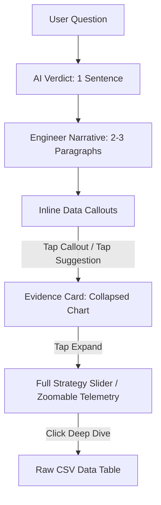

# FrontWing UI/UX Design System & Specification

> **Version**: 2.0.0 (Redesign from Zero)
> **Role**: Single Source of Truth for Product Design, Visuals, and Front-End Components
> **Philosophy**: Formula 1 Pit Wall meets Apple Hardware, Bloomberg Terminal density, Linear rigor, and Notion clarity.

---

## 1. Brand Personality & Visual Principles

### Brand Personality
FrontWing's interface is a tool for clinical race analysis, not an entertainment app or a marketing dashboard. The brand speaks like a senior race engineer: precise, calm, analytical, and context-aware.

*   **Rigorous & Analytical**: We do not speculate without timing loops or telemetry data. We present calculations.
*   **High-Fidelity & Clean**: The aesthetic is engineering-first. Data is displayed in compact mono grids; explanations are written in simple typography; evidence is structured and aligned.
*   **Tactile & Physical**: Borders feel like titanium components; layouts represent the physical constraints of F1 racing (tyre compounds, track coordinates, track temperature).

### Visual Principles
1.  **Narrative Over Dashboarding**: Data never exists for its own sake. It is summoned by the AI to answer a user's question. Every graph is labeled evidence.
2.  **No Dribbble Trends**: No frosted glass overlays, no huge purple-to-pink gradient backdrops, no soft floating shadows, and no mock hero illustrations of F1 cars.
3.  **High Information Density**: We do not fear numbers. We present lap charts, micro-deltas, weather histories, and tire age regressions in space-efficient grids. We avoid unnecessary whitespace.
4.  **Material Integrity**: Elements are solid. Colors are functional. Borders are sharp (1px, small radius). Visuals use solid canvas backings (`#090A0C`) and panel elements (`#0E1013`).

---

## 2. Spacing & Grid System

### Spacing System
We use a strict **4px-base** linear scale. Do not use arbitrary padding or margins.

| Token | Value | Tailwind Class | Usage |
| :--- | :--- | :--- | :--- |
| `space-xxs` | 4px | `p-1`, `m-1`, `gap-1` | Micro-separators, inline indicators, badge margins |
| `space-xs` | 8px | `p-2`, `m-2`, `gap-2` | Button padding, list-item gaps, labels to data gaps |
| `space-sm` | 12px | `p-3`, `m-3`, `gap-3` | Compact card inner padding, secondary elements gap |
| `space-md` | 16px | `p-4`, `m-4`, `gap-4` | Standard card padding, grid spacing, system margins |
| `space-lg` | 24px | `p-6`, `m-6`, `gap-6` | Panel gaps, outer margins for wide desktop monitors |
| `space-xl` | 32px | `p-8`, `m-8`, `gap-8` | Section separators, empty state vertical margins |
| `space-xxl` | 48px | `p-12`, `m-12` | Hero layout top margins |

### Grid System
We employ a high-density grid layout configured dynamically for investigation threads:

*   **Investigation Thread Width**: Fixed at `768px` (max-w-3xl) to maximize text legibility. Centered on screen.
*   **Grid Layouts for Evidence Cards**:
    *   *Grid-2*: `grid grid-cols-1 md:grid-cols-2 gap-4` (Used for strategy vs strategy, driver telemetry side-by-side)
    *   *Grid-3*: `grid grid-cols-1 sm:grid-cols-2 lg:grid-cols-3 gap-3` (Used for 3-axis ranking summaries or historical card lists)
    *   *Telemetry Layout*: Left-hand navigation tracking active thread sections (breadcrumbs), right-hand expanded canvas dashboard.

---

## 3. Typography Hierarchy

We use a two-font system to separate conversational narrative from physical telemetry numbers:
- **Primary Typeface**: `Outfit` or `Inter` (sans-serif) for system labels, AI text, headings, and explanations.
- **Tabular/Data Typeface**: `JetBrains Mono` or `Roboto Mono` (monospace) for sectors, lap times, gaps, G-forces, coordinates, speed values, and formulas.

```css
/* Typography Token Mappings */
--font-sans: 'Outfit', 'Inter', system-ui, sans-serif;
--font-mono: 'JetBrains Mono', 'Roboto Mono', monospace;
```

| Hierarchy | Size | Weight | Line Height | Tracking | Usage |
| :--- | :--- | :--- | :--- | :--- | :--- |
| `Display / Hero` | 32px | 600 | 1.2 | -0.03em | Featured Question, Hero landing overlays |
| `H1 / Section` | 20px | 600 | 1.3 | -0.02em | Investigation headers, large verdicts |
| `H2 / Component` | 14px | 500 | 1.4 | -0.01em | Evidence Card titles, sidebar elements |
| `Body / Narrative` | 14px | 400 | 1.55 | 0.01em | AI comments, explanations, help tooltips |
| `Mono Data` | 13px | 500 | 1.4 | 0.0em | Lap times, RPM, G-Force tickers, delta lists |
| `Metadata Mono` | 11px | 400 | 1.3 | 0.02em | Small compound identifiers, axis units, dates |

---

## 4. Color System

Colors are functional, not decorative. Accent colors represent physical F1 components, tire states, and DRS triggers.

### Canvas & Surfaces
| Token | HSL / Hex | Usage |
| :--- | :--- | :--- |
| `--color-bg` | `hsl(220, 18%, 5%)` / `#090A0C` | Pure canvas base, deep black-asphalt |
| `--color-panel` | `hsl(220, 15%, 8%)` / `#0E1013` | Component card backdrop, conversation blocks |
| `--color-elevated` | `hsl(220, 12%, 12%)` / `#16191E` | Hovered items, selectors, dropdown cards |
| `--color-border` | `hsla(220, 10%, 60%, 0.15)` | Sharp 1px card separators |
| `--color-border-active` | `hsla(220, 10%, 80%, 0.25)` | Focused card border, input outlines |

### Typography Colors
| Token | HSL / Hex | Usage |
| :--- | :--- | :--- |
| `--color-text-primary` | `hsl(210, 20%, 98%)` / `#F3F5F7` | Headings, active text, main values |
| `--color-text-secondary` | `hsl(215, 12%, 60%)` / `#8B95A5` | Main body paragraphs, description copy |
| `--color-text-muted` | `hsl(215, 10%, 40%)` / `#5C6470` | Inline labels, grid units, inactive links |

### Accent & Telemetry Indicators
| Token | HSL / Hex | Usage |
| :--- | :--- | :--- |
| `--color-f1-red` | `hsl(6, 100%, 50%)` / `#FF1801` | Brake lines, warning alerts, DNFs |
| `--color-drs-cyan` | `hsl(180, 100%, 45%)` / `#00E5FF` | DRS sectors, speed highlights, active states |
| `--color-teammate-yellow`| `hsl(48, 100%, 50%)` / `#FFD600` | Driver comparison (driver 2), apex limits |

### Tire Compounds
| Token | Compound | HSL / Hex | Color |
| :--- | :--- | :--- | :--- |
| `--color-tire-soft` | Soft | `hsl(354, 95%, 55%)` / `#FF2B49` | F1 Red |
| `--color-tire-medium` | Medium | `hsl(48, 100%, 50%)` / `#FFD600` | F1 Yellow |
| `--color-tire-hard` | Hard | `hsl(210, 10%, 90%)` / `#E5E7EB` | Titanium White |
| `--color-tire-inter` | Intermediate | `hsl(120, 75%, 45%)` / `#1BC944` | F1 Green |
| `--color-tire-wet` | Full Wet | `hsl(210, 100%, 50%)` / `#0D6EFD` | F1 Blue |

---

## 5. Motion, Easing & Animations

Animations must look crisp and instant. We do not use spring-bouncy, slow playful animations.

### Easing Tokens
*   **Standard Easing**: `cubic-bezier(0.16, 1, 0.3, 1)` (Ultra-smooth deceleration, mimics high-precision physical brakes)
*   **Fast Out Easing**: `cubic-bezier(0.4, 0, 1, 1)` (Used for rapid exits, collapses)
*   **Linear Easing**: `linear` (Used for telemetry stream tickers, progress fills)

### Duration Tokens
*   **Instant / Micro**: `80ms` (Hover states, borders, active focus switches)
*   **Fast / Slide**: `150ms` (Dropdown openings, inline expansions, state flips)
*   **Narrative Stream**: `30ms` (Per word letter-streaming in AI responses)
*   **Simulation Interpolation**: `300ms` (Transition of car nodes on the exit traffic map after slider release)

### Keyframe Animation Definitions
```css
/* AI Narrative Stream cursor */
@keyframes cursor-pulse {
  0%, 100% { opacity: 1; }
  50% { opacity: 0; }
}

/* Telemetry loading trace */
@keyframes trace-draw {
  from { stroke-dashoffset: 1000; }
  to { stroke-dashoffset: 0; }
}

/* Skeleton screen gradient */
@keyframes skeleton-shimmer {
  0% { background-position: -200% 0; }
  100% { background-position: 200% 0; }
}
```

---

## 6. Interaction & Component Design

### 6.1 Component Hierarchy

Every interface is mapped into the `InvestigationCanvas`:

```text
┌────────────────────────────────────────────────────────┐
│  BriefingHeader (Breadcrumbs, Search, Session State)   │
├────────────────────────────────────────────────────────┤
│                                                        │
│  InvestigationCanvas (Max width: 768px, Centered)      │
│  │                                                     │
│  ├── VerdictBlock (AI summary, confidence metric)      │
│  │                                                     │
│  ├── Paragraph (Narrative with inline callouts)        │
│  │                                                     │
│  ├── EvidenceCard (Gantt Strategy or Canvas Trace)     │
│  │   ├── Header (Description & Expand trigger)         │
│  │   ├── Visual Area (Tabular, SVG, or Canvas Grid)    │
│  │   └── DeepDive (Raw timing tables, export links)    │
│  │                                                     │
│  └── FollowUpSuggestionDeck                            │
│                                                        │
├────────────────────────────────────────────────────────┤
│  QuestionBar (Natural language input console)          │
└────────────────────────────────────────────────────────┘
```

### 6.2 Component Style Guide

#### 1) The QuestionBar
*   *Static State*: 1px border (`#1C2025`), backdrop (`#0E1013`), font mono, placeholder: *"Ask about any driver, lap, or strategy error..."*
*   *Focus State*: 1px active glow (`#00E5FF` at 0.15 opacity), border turns to titanium grey (`#5C6470`).
*   *Interaction*: Users type and hit Enter, or click suggested inline question chips.

#### 2) Evidence Cards
*   *Border*: Strict 1px flat edge (`#1C2025`). Corner radius: exactly `4px`.
*   *Header*: Monospace metadata labels on left; compact "Expand" chevron toggle on right.
*   *States*:
    *   *Collapsed*: Takes up `120px` height. Displays a high-level summary graph (e.g. 3-point stint summary).
    *   *Expanded*: Reveals full controls (interactive slider, toggle switches, synchronized telemetry timelines).
    *   *Deep Dive*: Expands to fill screen, rendering a monospace data table of sector times and tire wear slope values.

#### 3) Inline Callouts
*   Metrics referenced in the text must be formatted as bold mono pills:
    *   *Format*: `[Lap 22: +1.400s]` -> Bold, colored background matching target compound or delta state (e.g., green fill with green text at 10% opacity for time gain).
    *   *CSS*: `bg-drs-cyan/10 text-drs-cyan px-1.5 py-0.5 rounded-sm font-mono text-xs border border-drs-cyan/20`

---

## 7. Responsive & Adaptive Layouts

We do not hide data on mobile screens. Instead, we adapt the layout density.

### Breakpoint Matrix
*   **Mobile (< 640px)**: Thread takes 100% width. Evidence cards collapse to vertical list grids. Telemetry charts hide coordinates labels but maintain the raw trace line. Interactivity defaults to tap-and-slide.
*   **Tablet (640px - 1024px)**: Standard centered `InvestigationCanvas`. Interactive sliders scale to full width of the cards.
*   **Wide Desktop (> 1024px)**: Dual-pane layout is unlocked when a telemetry graph is expanded. The narrative thread stays on the left (`768px` wide), and the telemetry canvas slides out on the right (`600px` wide) for synchronized side-by-side debugging.

---

## 8. Data & Telemetry Visualization Principles

### Speed and Throttle Overlays (Canvas Rules)
1.  **Zero Line-Smoothing**: Telemetry traces must be rendered with absolute pixel precision. Do not apply cubic curves or Bezier interpolation. If the throttle drops instantly, the line must drop at a right angle.
2.  **Distance Alignment**: Never plot telemetry against time. Always align traces against track distance (meters from start/finish line). Slices are locked to 10m increments.
3.  **Contrast Levels**: The chaser is Neon Cyan (`#00E5FF`), the defender is Neon Yellow (`#FFD600`). Grid lines are muted slate (`#1C2025`) at `250m` track intervals.
4.  **Brake Overlay**: The brake pressure trace (0-100 bars) uses red neon overlay. Whenever brake pressure $> 10$ bar, the area under the trace is filled with `rgba(255, 24, 1, 0.08)`.

```javascript
// Correct Canvas Drawing Profile (No Smoothing)
ctx.beginPath();
ctx.lineWidth = 1.5;
ctx.strokeStyle = '#00E5FF';
ctx.lineJoin = 'miter'; // Prevents rounded apexes in corners
for (let i = 0; i < points.length; i++) {
  ctx.lineTo(points[i].x, points[i].y);
}
ctx.stroke();
```

### Stint Gantt Charts (SVG Rules)
1.  **Block Layout**: Tyre stints are flat rectangles. Height: `24px`. Corner radius: `2px`.
2.  **Color Codes**: The block fill color is strictly determined by the tire compound HSL tokens (`--color-tire-soft`, etc.).
3.  **Labeling**: Inside the block, render compound letter and stint length (e.g. `M1-22` in JetBrains Mono, center-aligned, absolute contrast). If the block is too narrow, hide text and display compound color only.

### Traffic Re-Entry Windows
1.  **Timeline orientation**: Vertical line representing time gap relative to the pitting driver exit coordinate.
2.  **Dirty Air Bottlenecks**: Zones where exit gap is $\le 1.5$ seconds behind a rival must be highlighted with a red diagonal strip pattern (`repeating-linear-gradient(45deg, #FF1801 0px, #FF1801 2px, transparent 2px, transparent 8px)`).
3.  **Clean Air Pockets**: Highlighted with a subtle DRS Cyan left-border glow.

---

## 9. Loading, Empty & Error States

### Loading States
We avoid spinning wheels. They suggest a static server search, whereas our engine is calculating physics.
*   **Narrative Loading**: AI text uses a flashing block cursor (`▋`) styled with `animate-[cursor-pulse_1s_infinite]`.
*   **Visual Evidence Loading**: The chart outlines render immediately. A linear progress bar fills left-to-right across the top edge of the card, styled in DRS Cyan.
*   **Skeleton Rules**: Monospace lists render mock characters `░░ ░░░ ░░` with a pulse animation to indicate pending numerical values.

### Empty States
*   **Context**: The Briefing Room when no session is selected.
*   **Design**: A clean map vector of the Spielberg track rendered in 1px outline (`#1C2025`). In the center, a simple query box.
*   **Narrative**: *"Select a Grand Prix weekend or ask a direct question to initialize the race engineer session."*

### Error States
*   **Concept**: Data mismatch or API telemetry dropout.
*   **Visual**: A thin Neon F1 Red left border on the card, with monospace text detailing the API exception code.
*   **Graceful Recovery**: *"Could not load sector telemetry. Falling back to Ergast timing arrays."* The page displays timing sheets and composite strategy logs instead of crash notifications.

---

## 10. AI Conversation & Progressive Disclosure

### Progressive Disclosure Model
Users must never be overwhelmed with raw charts on first render.



### Tone of Voice Rules
*   **Active Veracity**: Never output "I think" or "Maybe." Use calculations. Say *"Based on tire wear regression, Sainz lost pace consistency after Lap 24."*
*   **Logical Chains**: AI responses must follow the structure: **What happened** (verdict) $\rightarrow$ **Why** (explanation) $\rightarrow$ **Validation** (evidence card trigger) $\rightarrow$ **Alternative** (what-if recommendation).

---

## 11. Do's, Don'ts, and Anti-Patterns

### DO
*   Keep charts monochrome except for driver color identifiers.
*   Render telemetry traces at 1.5px lines with pixel gaps, showing every micro-oscillation.
*   Lock all margins and paddings strictly to the 4px scale.
*   Force all numerical values into `JetBrains Mono` with identical decimal positions (e.g., `1:18.240` rather than `1:18.24`).

### DON'T
*   Do not overlay charts with soft glassmorphism blur backgrounds.
*   Do not use generic SaaS icons (like gears for strategy, charts for performance, dashboard screens for homepage). Use F1-related icons or clean indicators (flags, tires, speed zones).
*   Do not put margins between charts. Stack them with shared distance axes to allow synchronized comparison.
*   Do not introduce round CTA buttons. Buttons must be hard-edged (corner radius `2px` or `4px` maximum) with subtle border triggers.

### The Dribbble SaaS Anti-Pattern (What to Avoid)
```text
┌────────────────────────────────────────────────────────┐
│ [❌ AVOID THIS LOOK]                                   │
│  Welcome Back, Driver! 👋 (Large purple font)          │
│                                                        │
│  ┌──────────────────┐  ┌──────────────────┐            │
│  │ 📈 Performance   │  │ 🚗 Car Stats     │ (Glassmorphic)│
│  │ +24% from yesterday│  │ +12hp (Huge stats)│            │
│  └──────────────────┘  └──────────────────┘            │
│                                                        │
│  [Cute 3D illustration of an F1 car floating in air]   │
└────────────────────────────────────────────────────────┘
```

### The FrontWing Pit Wall Pattern (What to Build)
```text
┌────────────────────────────────────────────────────────┐
│ [✅ BUILD THIS LOOK]                                   │
│  GP_DEBRIEF // SPIELBERG_GP_2024                       │
│                                                        │
│  VERDICT: Sainz strategy error on Lap 22 cost P2.      │
│  Pace decay slope: 0.078s/lap vs. median 0.052s/lap.   │
│                                                        │
│  TIMELINE [SPIELBERG_RACE_STINTS]                      │
│  VER [M1-23] [H24-51] [M52-71]                         │
│  SAI [M1-22] [H23-47] [M48-71]                         │
│                                                        │
│  SYS_STATUS: FastF1 downsampling aligned at 10m bins.  │
└────────────────────────────────────────────────────────┘
```
