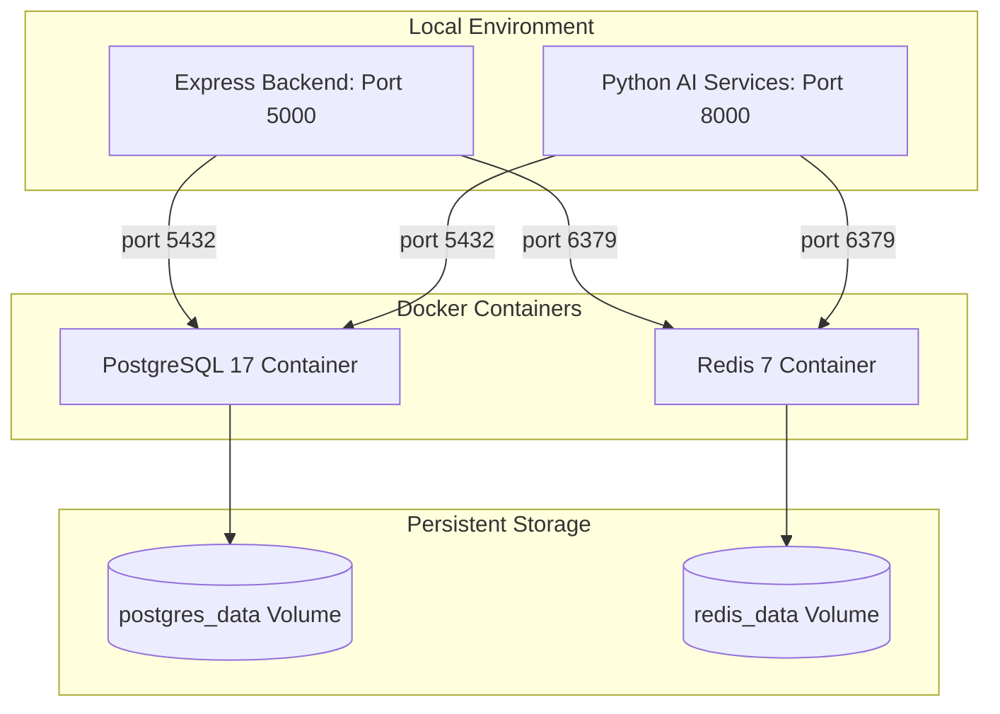

# FrontWing Database Infrastructure via Docker

This document outlines the Docker Compose infrastructure setup for FrontWing, running persistent storage engines locally.

## Architecture & Topology

The database layer runs containerized services locally to ensure isolated, reproducible, and persistent services.



## Services Summary

| Container Name | Service Image | Exposed Port | Internal Port | Volume Mount | Purpose |
| :--- | :--- | :--- | :--- | :--- | :--- |
| `frontwing-postgres` | `postgres:17-alpine` | `5432` | `5432` | `postgres_data` | Persistent storage for timing logs and telemetry caches |
| `frontwing-redis` | `redis:7-alpine` | `6379` | `6379` | `redis_data` | Key-value caching for LLM summaries and chat exchanges |

## How to Manage Services

All database service controls are run from the project root directory.

### Start Services (Detached mode)
```bash
docker compose up -d
```

### Stop Services
```bash
docker compose down
```

### Stop and Clear Volumes (Data wipe)
```bash
docker compose down -v
```

### View Service Logs
```bash
# View Postgres logs
docker compose logs postgres

# View Redis logs
docker compose logs redis
```

### Rebuild / Re-pull Images
```bash
docker compose pull
docker compose up -d --force-recreate
```

## Common Troubleshooting

### Port Conflicts
- **Error**: `port is already allocated` or `bind: address already in use`.
- **Cause**: A local instance of PostgreSQL (5432) or Redis (6379) is already running natively on the host machine.
- **Resolution**: Stop the native services:
  - Windows Command Prompt (Administrator):
    ```cmd
    net stop postgresql-x64-17
    ```
  - Windows Services GUI: Stop the `postgresql` and `redis` services.

### Connection Refused (Postgres or Redis unreachable)
- Verify the container status:
  ```bash
  docker compose ps
  ```
- Check logs for initialization errors:
  ```bash
  docker compose logs
  ```
