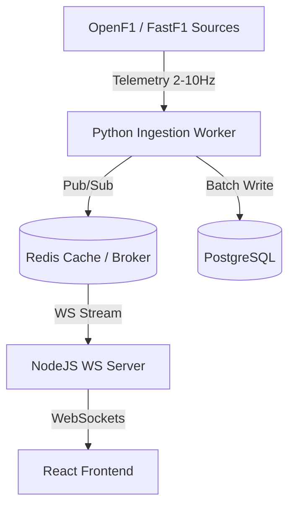

# FrontWing Learning Journal & System Design Insights

Welcome to the learning log. This file tracks key architectural concepts, concepts learned during building, F1 specific integration details, system design patterns, and placement/interview preparation notes.

---

## 1. Core Concepts & Tech Stack

### Dual-Runtime Synchronization (Node.js & Python)
- **Why?** Node.js excels at high-concurrency connections (WebSockets, HTTP API gateway) and light I/O operations. Python is the industry standard for scientific analysis, AI/ML (LangChain, LangGraph), and contains the `FastF1` SDK.
- **Inter-Process Communication (IPC)**:
  - **FastAPI HTTP Bridge**: For request-response patterns (e.g., generating a driver telemetry plot).
  - **Redis Message Broker**: For streaming data (pushing telemetry events from Python ingestion agents to Node.js WS servers) and task queueing.

### Formula 1 Data API Interfaces
- **Ergast API**: Traditional Developer API providing historical F1 context (schedules, drivers, constructor points, race positions from 1950 onwards). Primarily used for baseline database seeds.
- **OpenF1 API**: Real-time streaming API returning active car signals (lat/long, RPM, gear, speed, DRS) and timing data directly from the track. Useful for real-time dashboard visualization.
- **FastF1 SDK**: A powerful Python library built on top of Ergast and live timing channels, utilizing Pandas DataFrames to process deep telemetry (braking points, speed traces, throttle overlays).

---

## 2. Advanced Telemetry Serialization & Alignment

Telemetry data involves high-density numerical streams. For 20 cars streaming data at 10Hz, a standard JSON representation can be highly redundant. To scale this for thousands of concurrent users:

1. **Delta-Compression (Run-Length & Delta)**:
   - Cars spend significant periods at 100% throttle (straights) or 0% brake. Instead of sending full values, we serialize only the changes (deltas) from the previous record.
2. **Binary Packing (Protocol Buffers)**:
   - We pack coordinates and car statuses into a compact schema definition. A Protobuf representation reduces the payload size by over **70%** (~35-40 bytes per message), saving massive server-client bandwidth.
3. **Downsampling (LTTB Algorithm)**:
   - When rendering long telemetry comparison graphs (e.g., a full 70-lap speed trace), rendering 70,000 coordinates will crash the browser. We implement the **Largest-Triangle-Three-Buckets (LTTB)** downsampling algorithm on the Python FastAPI service to compress telemetry profiles to a maximum of 1,000 visually significant peaks before serializing to JSON.

### Comparative Distance Alignment
When comparing two driver laps (e.g. for our **Telemetry-Driven Ghost Battle Dialogue**), aligning coordinates by time creates significant drift (since one driver apexes later or carries more speed). To resolve this, we align the data frames by **Distance (in meters)** along the track center-line. We slice the track into 10-meter bins, interpolate telemetry variables (Speed, Throttle, Brake) within each bin, and compare values at identical spatial coordinates.

---

## 3. LangGraph Orchestration Patterns

We orchestrate our AI services using a **LangGraph StateGraph** to manage multi-turn dialogues and tools, powered by **Gemini 2.5 Flash** as primary and **Groq** as secondary fallback.

```python
from typing import Annotated, TypedDict
from langgraph.graph import StateGraph, END
from langgraph.graph.message import add_messages

# 1. State Definition
class AgentState(TypedDict):
    messages: Annotated[list, add_messages]
    active_agent: str
    telemetry_data: dict
    simulated_outcomes: dict

# 2. Reducer Mechanics
# The 'add_messages' annotation tells LangGraph to append new agent outputs to the existing state
# list rather than overwriting it, maintaining historical session context.
```

### Multi-Provider Fallback Pattern
To ensure high availability and bypass API limits:
1. **Gemini 2.5 Flash (Primary)**: Takes advantage of massive input token thresholds (highly useful for attaching full lap timing matrices to LLM contexts).
2. **Groq (Secondary)**: Fast LLaMA 3.1 inference is used if the Gemini client encounters a 429 rate limit or network timeout.
3. **OpenRouter (Tertiary)**: Provides a global proxy mapping to route requests through optional alternative nodes.

---

## 4. System Design Insights

### Live Telemetry Pipeline (Scale & Sub-second Latency)
To stream real-time car metrics (20 cars, sending updates at 2-10Hz, resulting in up to 200 telemetry rows/sec):
1. **Ingestion Layer**: A lightweight Python daemon polls OpenF1 API and writes telemetry packages to a Redis Stream/PubSub channel.
2. **Cache layer**: Redis caches the current lap's telemetry in memory. Writing this directly to PostgreSQL would bottleneck the database.
3. **Gateway Layer**: Node.js WebSocket cluster subscribes to the Redis PubSub channels, streaming coordinates to active web clients.
4. **Persistence Layer**: A worker processes chunks of telemetry (every lap or session end), batch-saving them to PostgreSQL for long-term historical analysis.



---

## 5. Interview Preparation & Placement Notes

### High-Frequency Data Storage
* **Question**: How do you avoid database lock-ups when storing 200 telemetry points per second?
* **Answer**: We buffer telemetry updates in Redis sorted sets (`ZADD` with timestamp as score) and use a background task to dump them in bulk (bulk inserts) to PostgreSQL/TimescaleDB. This converts thousands of singular writes into a single transaction block.

### Telemetry Downsampling Algorithms
* **Question**: When plotting lap traces on client dashboards, how do you handle data transmission for a 1.5-hour race with 10Hz sampling?
* **Answer**: We downsample the data using the LTTB (Largest-Triangle-Three-Buckets) algorithm on the backend. LTTB divides the data into buckets and selects one point per bucket that maximizes the visual area of the triangle formed with adjacent points, preserving critical speed apexes and braking drops while reducing data footprint by 95%+.

### Mathematical Telemetry Scoring Logic
* **Question**: How do you calculate a driver's tire management score mathematically without relying on LLM summaries?
* **Answer**: We isolate clean air laps and calculate a linear regression of lap times against tire age ($L_k = L_{\text{base}} + \beta \cdot k$). The slope ($\beta$) represents the driver's pace decay rate. We score the driver by comparing their decay rate ($\beta_{\text{driver}}$) against the grid's median decay rate ($\bar{\beta}_{\text{grid}}$) for that compound. This ensures the output is verifiable and grounded in timing statistics.

* **Question**: How do you avoid statistical compression in Pace consistency and speed margin calculations?
* **Answer**: Legacy formulas divided standard deviation ($\sigma$) and pace deficit by the absolute mean lap time (e.g., 70s), which compressed all driver scores to 97-99%. We refine this by scaling both factors against absolute thresholds: Consistency is scaled against $\sigma_{\text{limit}} = 1.5\text{s}$, and SpeedMargin is scaled against $\Delta_{\text{pace\_limit}} = 2.0\text{s}$. This expands the scoring range dynamically to show clear pace differentials.

* **Question**: How do you isolate strategy performance from driver-driven on-track overtakes?
* **Answer**: We modify Strategic Position Gain (SPG) to subtract on-track overtakes made during the pit cycle window ($L_p \to L_p + 3$). If a position is gained by overtaking on track, the driver gets the credit in Execution/Pace, while the Strategy Score remains neutral. Conversely, if a position is gained via pit window timing (e.g., an undercut) without an on-track pass, the strategy team receives full credit.

* **Question**: How does the Execution Score reward dominant front-runners and avoid the "Winner's Penalty"?
* **Answer**: Traditional progression metrics penalize drivers starting on pole ($P_{\text{start}} - P_{\text{finish}} = 0$) while rewarding back-of-the-grid chargers. We introduce a Position Performance Factor (PPF) combining Progression and Retention. Retention adds a bonus $2 \cdot (11 - P_{\text{finish}})$ for finishing in the top 10 as long as $P_{\text{finish}} \le P_{\text{start}}$. A flawless lights-to-flag pole-to-victory receives a +20 Retention bonus, offsetting minor errors (lockups/warnings) and yielding a perfect 100.

### Differentiating Driver vs. Crew Pit Stop Metrics
* **Question**: How do you evaluate pit stops without penalizing the driver for crew errors?
* **Answer**: We split pit stops into two distinct factors: the **Stationary Factor** ($\text{SF}$), which measures crew speed (wheel changes), and the **Lane Factor** ($\text{LF}$), which evaluates the driver's entry/exit deceleration and acceleration profiles in the speed-limit zone. By weighting these factors separately, we isolate the driver's execution.

### Strategy Simulation Engine Constraints
* **Question**: How do you simulate a "What-if" pit stop event on a specific lap?
* **Answer**: We compute the remaining laps $N$ and calculate the simulated race time. We apply a pit lane loss penalty ($T_{\text{loss}}$) on the pit lap, reset tire age to 0, and project new compound degradation rates. Crucially, we apply a **Traffic Bottleneck Constraint**: if the driver exits within 1.0 second of a rival, their simulated pace is capped to the rival's pace unless the pace differential exceeds the circuit's Overtake Difficulty Index ($OD$).

### Product Performance Metrics (Engagement & Retention)
* **Question**: How would you define key success metrics for an F1 analytical platform like FrontWing?
* **Answer**: 
  1. **Weekly Active Users / Monthly Active Users (WAU/MAU)**: Expected to spike during Grand Prix weekends (Friday-Sunday). We monitor active sessions specifically on race Sundays and the immediate 24 hours post-race (Monday).
  2. **Feature Adoption Rate**: Track query volumes on the "What-If Strategy Simulator" and "Ghost Battle Dialogue".
  3. **Viral Share Quotient**: The percentage of users clicking "Export Ghost Card" and sharing it to external links (Reddit, X, Discord).

---

## 6. Data Ingestion & Scheduling Design Patterns

During the construction of FrontWing's data foundation layer, several key database and scheduling architectural patterns were established:

### Abstract Base Collector & Retry Policies
1. **Separation of Concerns**: The abstract `BaseCollector` isolates network collection from validation and saving.
2. **Exponential Backoff**: To avoid hammering public CDNs during network glitches, API retries double the wait time dynamically ($delay = initial\_delay \times 2^{retry\_index}$).
3. **Upsert Performance**: Using standard `INSERT ... ON CONFLICT DO UPDATE` patterns ensures that duplicate items are handled gracefully by PostgreSQL rather than generating application exceptions.

### Multi-Frequency Scheduling Loops
- **Static Ingestion**: Historical driver registers and schedules are fetched once daily as they rarely change.
- **Active Streaming**: Live weather records and timings are queried every 10-15 seconds during active sessions. Live car positioning metrics are processed and streamed immediately to Redis Stream hashes (`XADD`) to support real-time WebSocket distribution without blocking transactional tables.

---

## 7. Version Control & Repository Best Practices

During the final pre-production git audit, several standard version control protocols were defined:

### Decoupled Dual-Runtime Git Exclusion
1. **Virtual Environments (`venv`)**: Excluded to ensure the large packages (Pandas, FastF1, NumPy) are rebuilt cleanly via `requirements.txt` instead of bloated commits.
2. **Node Modules (`node_modules`)**: Standard Javascript exclusion. Both frontend and backend directories maintain independent package trees.
3. **F1 Caches (FastF1 & Telemetry)**: FastF1 downloads hundreds of megabytes of raw timing arrays per session. Excluding these directories (`fastf1_cache/`, `telemetry_cache/`) keeps the repository lean and prevents hitting system quotas.
4. **Environment Secrets (`.env`)**: Standard precaution ensuring API keys (Gemini, database credentials) are never pushed to remote remotes.

