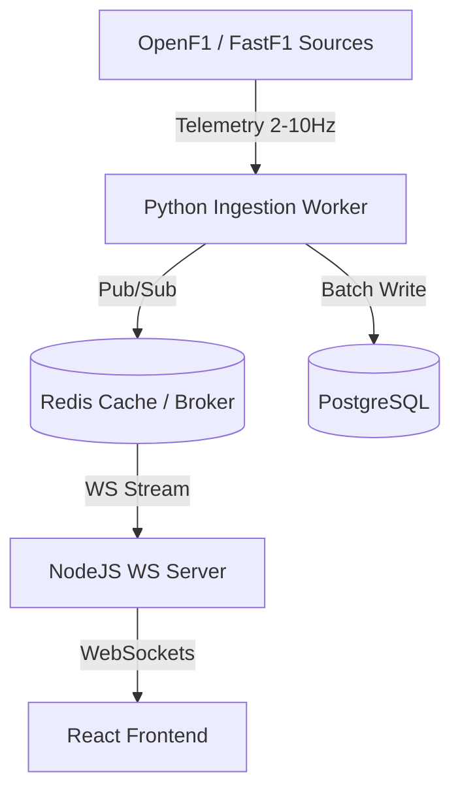

# FrontWing Learning Journal & System Design Insights

Welcome to the learning log. This file tracks key architectural concepts, concepts learned during building, F1 specific integration details, system design patterns, and placement/interview preparation notes.

---

## 1. Core Concepts & Tech Stack

### Dual-Runtime Synchronization (Node.js & Python)
- **Why?** Node.js excels at high-concurrency connections (WebSockets, HTTP API gateway) and light I/O operations. Python is the industry standard for scientific analysis, AI/ML (LangChain, LangGraph), and contains the `FastF1` SDK.
- **Inter-Process Communication (IPC)**:
  - **FastAPI HTTP Bridge**: For request-response patterns (e.g., generating a driver telemetry plot).
  - **Redis Message Broker**: For streaming data (pushing telemetry events from Python ingestion agents to Node.js WS servers) and task queueing.

### Formula 1 Data API Interfaces
- **Ergast API**: Traditional Developer API providing historical F1 context (schedules, drivers, constructor points, race positions from 1950 onwards). Primarily used for baseline database seeds.
- **OpenF1 API**: Real-time streaming API returning active car signals (lat/long, RPM, gear, speed, DRS) and timing data directly from the track. Useful for real-time dashboard visualization.
- **FastF1 SDK**: A powerful Python library built on top of Ergast and live timing channels, utilizing Pandas DataFrames to process deep telemetry (braking points, speed traces, throttle overlays).

---

## 2. Advanced Telemetry Serialization & Alignment

Telemetry data involves high-density numerical streams. For 20 cars streaming data at 10Hz, a standard JSON representation can be highly redundant. To scale this for thousands of concurrent users:

1. **Delta-Compression (Run-Length & Delta)**:
   - Cars spend significant periods at 100% throttle (straights) or 0% brake. Instead of sending full values, we serialize only the changes (deltas) from the previous record.
2. **Binary Packing (Protocol Buffers)**:
   - We pack coordinates and car statuses into a compact schema definition. A Protobuf representation reduces the payload size by over **70%** (~35-40 bytes per message), saving massive server-client bandwidth.
3. **Downsampling (LTTB Algorithm)**:
   - When rendering long telemetry comparison graphs (e.g., a full 70-lap speed trace), rendering 70,000 coordinates will crash the browser. We implement the **Largest-Triangle-Three-Buckets (LTTB)** downsampling algorithm on the Python FastAPI service to compress telemetry profiles to a maximum of 1,000 visually significant peaks before serializing to JSON.

### Comparative Distance Alignment
When comparing two driver laps (e.g. for our **Telemetry-Driven Ghost Battle Dialogue**), aligning coordinates by time creates significant drift (since one driver apexes later or carries more speed). To resolve this, we align the data frames by **Distance (in meters)** along the track center-line. We slice the track into 10-meter bins, interpolate telemetry variables (Speed, Throttle, Brake) within each bin, and compare values at identical spatial coordinates.

---

## 3. LangGraph Orchestration Patterns

We orchestrate our AI services using a **LangGraph StateGraph** to manage multi-turn dialogues and tools, powered by **Gemini 2.5 Flash** as primary and **Groq** as secondary fallback.

```python
from typing import Annotated, TypedDict
from langgraph.graph import StateGraph, END
from langgraph.graph.message import add_messages

# 1. State Definition
class AgentState(TypedDict):
    messages: Annotated[list, add_messages]
    active_agent: str
    telemetry_data: dict
    simulated_outcomes: dict

# 2. Reducer Mechanics
# The 'add_messages' annotation tells LangGraph to append new agent outputs to the existing state
# list rather than overwriting it, maintaining historical session context.
```

### Multi-Provider Fallback Pattern
To ensure high availability and bypass API limits:
1. **Gemini 2.5 Flash (Primary)**: Takes advantage of massive input token thresholds (highly useful for attaching full lap timing matrices to LLM contexts).
2. **Groq (Secondary)**: Fast LLaMA 3.1 inference is used if the Gemini client encounters a 429 rate limit or network timeout.
3. **OpenRouter (Tertiary)**: Provides a global proxy mapping to route requests through optional alternative nodes.

---

## 4. System Design Insights

### Live Telemetry Pipeline (Scale & Sub-second Latency)
To stream real-time car metrics (20 cars, sending updates at 2-10Hz, resulting in up to 200 telemetry rows/sec):
1. **Ingestion Layer**: A lightweight Python daemon polls OpenF1 API and writes telemetry packages to a Redis Stream/PubSub channel.
2. **Cache layer**: Redis caches the current lap's telemetry in memory. Writing this directly to PostgreSQL would bottleneck the database.
3. **Gateway Layer**: Node.js WebSocket cluster subscribes to the Redis PubSub channels, streaming coordinates to active web clients.
4. **Persistence Layer**: A worker processes chunks of telemetry (every lap or session end), batch-saving them to PostgreSQL for long-term historical analysis.



---

## 5. Interview Preparation & Placement Notes

### High-Frequency Data Storage
* **Question**: How do you avoid database lock-ups when storing 200 telemetry points per second?
* **Answer**: We buffer telemetry updates in Redis sorted sets (`ZADD` with timestamp as score) and use a background task to dump them in bulk (bulk inserts) to PostgreSQL/TimescaleDB. This converts thousands of singular writes into a single transaction block.

### Telemetry Downsampling Algorithms
* **Question**: When plotting lap traces on client dashboards, how do you handle data transmission for a 1.5-hour race with 10Hz sampling?
* **Answer**: We downsample the data using the LTTB (Largest-Triangle-Three-Buckets) algorithm on the backend. LTTB divides the data into buckets and selects one point per bucket that maximizes the visual area of the triangle formed with adjacent points, preserving critical speed apexes and braking drops while reducing data footprint by 95%+.

### Mathematical Telemetry Scoring Logic
* **Question**: How do you calculate a driver's tire management score mathematically without relying on LLM summaries?
* **Answer**: We isolate clean air laps and calculate a linear regression of lap times against tire age ($L_k = L_{\text{base}} + \beta \cdot k$). The slope ($\beta$) represents the driver's pace decay rate. We score the driver by comparing their decay rate ($\beta_{\text{driver}}$) against the grid's median decay rate ($\bar{\beta}_{\text{grid}}$) for that compound. This ensures the output is verifiable and grounded in timing statistics.

* **Question**: How do you avoid statistical compression in Pace consistency and speed margin calculations?
* **Answer**: Legacy formulas divided standard deviation ($\sigma$) and pace deficit by the absolute mean lap time (e.g., 70s), which compressed all driver scores to 97-99%. We refine this by scaling both factors against absolute thresholds: Consistency is scaled against $\sigma_{\text{limit}} = 1.5\text{s}$, and SpeedMargin is scaled against $\Delta_{\text{pace\_limit}} = 2.0\text{s}$. This expands the scoring range dynamically to show clear pace differentials.

* **Question**: How do you isolate strategy performance from driver-driven on-track overtakes?
* **Answer**: We modify Strategic Position Gain (SPG) to subtract on-track overtakes made during the pit cycle window ($L_p \to L_p + 3$). If a position is gained by overtaking on track, the driver gets the credit in Execution/Pace, while the Strategy Score remains neutral. Conversely, if a position is gained via pit window timing (e.g., an undercut) without an on-track pass, the strategy team receives full credit.

* **Question**: How does the Execution Score reward dominant front-runners and avoid the "Winner's Penalty"?
* **Answer**: Traditional progression metrics penalize drivers starting on pole ($P_{\text{start}} - P_{\text{finish}} = 0$) while rewarding back-of-the-grid chargers. We introduce a Position Performance Factor (PPF) combining Progression and Retention. Retention adds a bonus $2 \cdot (11 - P_{\text{finish}})$ for finishing in the top 10 as long as $P_{\text{finish}} \le P_{\text{start}}$. A flawless lights-to-flag pole-to-victory receives a +20 Retention bonus, offsetting minor errors (lockups/warnings) and yielding a perfect 100.

### Differentiating Driver vs. Crew Pit Stop Metrics
* **Question**: How do you evaluate pit stops without penalizing the driver for crew errors?
* **Answer**: We split pit stops into two distinct factors: the **Stationary Factor** ($\text{SF}$), which measures crew speed (wheel changes), and the **Lane Factor** ($\text{LF}$), which evaluates the driver's entry/exit deceleration and acceleration profiles in the speed-limit zone. By weighting these factors separately, we isolate the driver's execution.

### Strategy Simulation Engine Constraints
* **Question**: How do you simulate a "What-if" pit stop event on a specific lap?
* **Answer**: We compute the remaining laps $N$ and calculate the simulated race time. We apply a pit lane loss penalty ($T_{\text{loss}}$) on the pit lap, reset tire age to 0, and project new compound degradation rates. Crucially, we apply a **Traffic Bottleneck Constraint**: if the driver exits within 1.0 second of a rival, their simulated pace is capped to the rival's pace unless the pace differential exceeds the circuit's Overtake Difficulty Index ($OD$).

* **Question**: Describe the exact step-by-step logic of the spatial Traffic Bottleneck algorithm.
* **Answer**: 
  1. At each lap $k$, we locate the driver immediately ahead on track by looking for the rival with the largest cumulative actual race time $T_{\text{rival}}(k-1)$ that is less than the driver's simulated cumulative time $T_{\text{driver\_sim}}(k-1)$.
  2. The gap to this rival is $\text{Gap} = T_{\text{driver\_sim}}(k-1) - T_{\text{rival}}(k-1)$.
  3. If $\text{Gap} \le 1.0$ second, the driver is in dirty air. If their projected natural pace is faster than the rival ($L_{\text{natural}} < L_{\text{rival\_actual}}$), we check if the delta $\Delta = L_{\text{rival\_actual}} - L_{\text{natural}} > OD$ (Overtake Difficulty).
  4. If $\Delta > OD$, they run $L_{\text{natural}}$ and overtake. Otherwise, they are stuck, and their cumulative time at the end of the lap is capped to the rival's time plus a follow gap ($T_{\text{driver\_sim}}(k) = T_{\text{rival\_actual}}(k) + 0.6$ seconds).
  5. If $\text{Gap} > 1.0$ second, they run in clean air, but we check if they caught up during the lap. If $T_{\text{driver\_sim}}(k) < T_{\text{rival\_actual}}(k)$, we cap their cumulative time at the end of the lap to the rival's time plus $0.6$ seconds.

* **Question**: Why is a full-grid multi-agent model (V2) required instead of simulating a single modified driver against static rivals (V1)?
* **Answer**: Simulating a single driver against static actual timelines ignores second-order race effects. For example, if we pit Leclerc on lap 20 instead of 25, he might exit behind a slower driver who had already pitted. Leclerc gets held up in traffic, which modifies his pace. Simultaneously, the driver Leclerc exits behind is now under pressure, altering their defensive lines, and the drivers behind Leclerc are released from his traffic, letting them push in clean air. A full-grid model re-sorts and updates the dirty air states of all 20 drivers dynamically on every lap, modeling realistic grid interactions.

* **Question**: How does the V2 engine model the tradeoff between an undercut and an overcut?
* **Answer**: The V2 engine simulates the physical and thermodynamic trade-offs:
  - **Undercut**: A driver pits early to mount fresh tires (resetting degradation age). This is penalized by the pit lane loss ($T_{\text{loss}}$) and a thermal warmup delay ($\theta_{\text{warmup}}$) on the out-lap (Soft = 0.3s, Medium = 0.6s, Hard = 1.2s). If they clear traffic, they gain massive lap time delta.
  - **Overcut**: The rival stays out on worn tires. If the pitting driver exits into traffic (dirty air), their pace is capped to the traffic queue speed. The rival staying out in clean air runs faster than the traffic-stuck driver, successfully executing the overcut when they pit later.

* **Question**: Explain how DRS availability and overtake difficulty are modeled mathematically in the V2 engine.
* **Answer**: 
  - **DRS**: We check the gap $G_i(k-1)$ at the end of the previous lap. If $G_i(k-1) \le 1.0\text{s}$, the chasing driver receives a DRS pace boost of $\delta_{\text{DRS}} = 0.4$ seconds (representing the drag reduction advantage on straights) on the next lap: $L_{i,\text{DRS}}(k) = L_{i,\text{natural}}(k) - \delta_{\text{DRS}}$.
  - **Overtake Probability**: We use a sigmoidal logistic regression model:
    $$P_{\text{overtake}} = \frac{1}{1 + e^{-k_{\text{sens}} \cdot (\Delta_{\text{pace}} + \delta_{\text{DRS}} - OD)}}$$
    where $\Delta_{\text{pace}} = L_{i-1,\text{natural}} - L_{i,\text{natural}}$ is the pace advantage, and $OD$ is the circuit-specific overtake difficulty threshold. In deterministic mode, the overtake succeeds if $P_{\text{overtake}} \ge 0.5$ (meaning total pace advantage $\ge OD$). In Monte Carlo mode, we sample from a uniform distribution to determine success, allowing realistic stochastic race order shuffles.


### Product Performance Metrics (Engagement & Retention)
* **Question**: How would you define key success metrics for an F1 analytical platform like FrontWing?
* **Answer**: 
  1. **Weekly Active Users / Monthly Active Users (WAU/MAU)**: Expected to spike during Grand Prix weekends (Friday-Sunday). We monitor active sessions specifically on race Sundays and the immediate 24 hours post-race (Monday).
  2. **Feature Adoption Rate**: Track query volumes on the "What-If Strategy Simulator" and "Ghost Battle Dialogue".
  3. **Viral Share Quotient**: The percentage of users clicking "Export Ghost Card" and sharing it to external links (Reddit, X, Discord).

### Premium UI & Telemetry Performance Optimization
* **Question**: How do you optimize telemetry graph rendering to handle massive streaming timing charts (e.g. Speed, Throttle, Brake coordinates) at 60 FPS without dropping frames?
* **Answer**: We employ three key optimizations:
  1. **Canvas-Based Rendering**: Instead of rendering SVG nodes for thousands of points, which bloats the DOM, we paint directly to an HTML5 `<canvas>` element using CPU/GPU-accelerated context drawing.
  2. **Downsampling (LTTB)**: We run the LTTB algorithm on the Python microservice to limit coordinates to a maximum of 1,000 values, which represents the visual limit of most displays.
  3. **Offscreen Canvas & requestAnimationFrame**: For drag-and-drop actions on sliders, we render calculations to an `OffscreenCanvas` in a Web Worker, and only sync the drawing coordinates to the primary canvas on the next browser redraw using `requestAnimationFrame`.

* **Question**: How do you avoid state synchronization bottlenecks when drag-and-drop slider adjustments on the Strategy timeline dynamically trigger full-grid multi-agent updates?
* **Answer**: We use a split-state atomic architecture powered by `Jotai`:
  1. **Transient State**: The slider value itself is tracked in a fast, localized react state or custom ref (`useRef`) to enable smooth 60 FPS drag visual feedback.
  2. **Debounced Computation**: We debounce the actual simulation trigger (e.g., 50ms pause) before calling the background engine to re-run projections. This prevents overloading the Python FastAPI service with overlapping HTTP requests on every single pixel movement.
  3. **Atomic Selection**: Leading and trailing timing views subscribe only to specific atomic subsets of the grid times, avoiding full-page re-renders.

---

## 6. Data Ingestion & Scheduling Design Patterns

During the construction of FrontWing's data foundation layer, several key database and scheduling architectural patterns were established:

### Abstract Base Collector & Retry Policies
1. **Separation of Concerns**: The abstract `BaseCollector` isolates network collection from validation and saving.
2. **Exponential Backoff**: To avoid hammering public CDNs during network glitches, API retries double the wait time dynamically ($delay = initial\_delay \times 2^{retry\_index}$).
3. **Upsert Performance**: Using standard `INSERT ... ON CONFLICT DO UPDATE` patterns ensures that duplicate items are handled gracefully by PostgreSQL rather than generating application exceptions.

### Multi-Frequency Scheduling Loops
- **Static Ingestion**: Historical driver registers and schedules are fetched once daily as they rarely change.
- **Active Streaming**: Live weather records and timings are queried every 10-15 seconds during active sessions. Live car positioning metrics are processed and streamed immediately to Redis Stream hashes (`XADD`) to support real-time WebSocket distribution without blocking transactional tables.

---

## 7. Version Control & Repository Best Practices

During the final pre-production git audit, several standard version control protocols were defined:

### Decoupled Dual-Runtime Git Exclusion
1. **Virtual Environments (`venv`)**: Excluded to ensure the large packages (Pandas, FastF1, NumPy) are rebuilt cleanly via `requirements.txt` instead of bloated commits.
2. **Node Modules (`node_modules`)**: Standard Javascript exclusion. Both frontend and backend directories maintain independent package trees.
3. **F1 Caches (FastF1 & Telemetry)**: FastF1 downloads hundreds of megabytes of raw timing arrays per session. Excluding these directories (`fastf1_cache/`, `telemetry_cache/`) keeps the repository lean and prevents hitting system quotas.
4. **Environment Secrets (`.env`)**: Standard precaution ensuring API keys (Gemini, database credentials) are never pushed to remote remotes.

---

## 8. Frontend Engineering & Telemetry UI Insights

During the construction of FrontWing Frontend V1, several engineering practices were established:

### Vite Entrypoint Integration
* **HTML Asset Resolution**: Standard Vite projects require `index.html` at the workspace root to serve as the compiler's dependency graph starting point. Stylesheets and TSX entrypoints must be explicitly linked within it to allow Vite's bundler to perform tree-shaking and asset optimizations.

### Strict TypeScript Quality Enforcements
* **Unused Declarations**: FrontWing uses strict compiler guidelines (`noUnusedLocals`, `noUnusedParameters`). Declarations that are left unused (such as unused icons or variables mapped from HSL structures) trigger compilation breaks to prevent build bloating. Clean, strict imports are maintained proactively.

### CSS Custom Variables Mapping
* **Dynamic Utility Classes**: Mapping CSS variables (e.g. `--color-tire-soft`) inside `tailwind.config.js` allows developers to combine Vanilla CSS token definitions with Tailwind's utility class mapping (e.g., `text-tire-soft` or `border-tire-soft/30`), maintaining a single source of truth for the color tokens.

### Editorial Layout & Visual Storytelling
* **Media-Driven Editorial Context**: Premium visual interfaces (like Apple TV or F1 TV) use full-bleed track graphic overlays or high-impact imagery behind narrative titles. This provides immediate context and converts the landing page from a sterile timing grid into an active story gateway.
* **Component De-tabulation**: Transitioning list structures into styled car rows and progress indicators (e.g., in the Exit Traffic visualizer) improves accessibility and prevents the site from looking like an administrative dashboard.

---

## 9. Premium Creative Redesign & Interactive Storytelling Insights

Following the directives of UI Creative Director Mode, the landing page was completely re-engineered from a simple Timing Grid list into an immersive, narrative-driven motorsport intelligence experience.

### A) Design Decisions & Motion System
1. **High-Frequency Telemetry loops**: Rather than displaying static visual components, the hero contains an active, loops-driven SVG vector map of the Spielberg circuit. Two colored nodes (Red Bull - Cyan, Ferrari - Red) loop continuously. It is accompanied by a live telemetry dashboard reading active speed, throttle/brake overlays, and G-force calculations updating every 450ms, giving immediate visual credibility.
2. **Interactive Slider Strategy Sandbox**: The "What-If" Strategy Playground allows the user to drag a pit stop slider from Lap 15 to 30. Doing so recalculates and animates:
   - Relative exit coordinates of Sainz on track between Piastri and Hamilton.
   - Projected time deltas (+1.400s to -3.200s) and finishing ranks.
   - Horizontal stint timeline bars resizing their color segments dynamically.
3. **Tabbed Formula Scorecards**: Exact LaTeX equations used by the scoring engine are rendered alongside real rankings of the top 3 drivers of the Austrian GP. This validates the deterministic nature of the backend scores and builds trust with engineers and F1 fans.
4. **Motion System**: Smooth CSS spring dynamics (`framer-motion`) are used to glide elements (e.g., the exit location car pill) when state boundaries change, ensuring the transitions feel tactile and fast.

### B) Inspiration Sources
- **McLaren Racing & F1 TV**: High-contrast dark asphalt canvas background (`#090A0C`), titanium grey panel outlines, bold neon F1 Red (`#FF1801`) brake triggers, and DRS Cyan (`#00E5FF`) speed highlights. The layout copies the aesthetics of a team pit wall.
- **Stripe & Linear**: Smooth hover border-glow gradients, grid layouts with subtle micro-borders, clean typography scales (Outfit / Inter / JetBrains Mono), and fully interactive play sandboxes that show product utility without requiring a user login.
- **Porsche & Rivian**: High-impact editorial headings, large cinematic text layouts, and prioritizing aesthetic pacing/depth over high data density.

### C) Section-by-Section Roles
1. **Section 1: Hero Story**: Establishes immediate brand validation. Demonstrates the core thesis that "Winning is a calculation" via the looping Spielberg map and real-time telemetry feed before the user even scrolls.
2. **Section 2: Capabilities Matrix**: Illustrates the three main platform tools (Strategy Simulator, Ghost Battle, Race Intelligence) with compact visual previews, prompting exploration.
3. **Section 3: Interactive Sandbox**: Drives engagement. Allows the user to touch the strategy variables immediately and see how an undercut alters race coordinates in real-time.
4. **Section 4: Scoring Index Deck**: Explains the math. Tabulates the 5 deterministic scores (Strategy, Tire, Pace, Pit, Execution) and presents the actual equations to prove it is a scientific tool rather than a generic SaaS mock.
5. **Section 5: Pit Wall Terminal (CTA)**: Re-engages the user with a scrolling system log of active processes and provides the gateway launch button.

---

## 10. Product Design Post-Mortem: Why Every Prior UI Decision Failed

> **Date**: 2026-06-28
> **Author**: Head of Product Design & UX
> **Verdict**: All prior frontend work (Landing page, AppShell, Design Bible, wireframes, ui_architecture.md) is classified as **failed experiments**. The code remains in the repository for reference but must not be reused in the redesign.

### The Core Failure

We built an **F1 dashboard**. We should have built an **AI Race Engineer**.

Every design decision flowed from the wrong starting question. We asked *"What data should we show?"* instead of *"What question is the user trying to answer?"*. The result was a technically impressive but emotionally hollow product that no casual fan would ever return to and no expert would prefer over a Python script.

### Failure 1: Dashboard-First Thinking Instead of Experience-First Thinking

The entire product was structured around a traditional SaaS information architecture: Sidebar → Pages → Panels → Cards → Data. This is how you design Jira. This is not how you design a product that makes someone feel like they're investigating a race.

**Evidence**: The `AppShell` component (`Shell.tsx`) implemented a fixed sidebar with navigation items (Drivers, Teams, Simulate, Battle). The routing (`App.tsx`) mapped five static page routes. Every page was a container waiting to be filled with widgets. The product felt like an empty office building.

**What we should have done**: Start from a single, powerful interaction—asking a question—and let the interface grow organically around the answer.

### Failure 2: Showing Telemetry Before Telling a Story

The landing page (`Landing.tsx`, 787 lines) opened with a looping telemetry animation cycling through hardcoded speed/throttle/brake values every 450ms. It was technically impressive and absolutely meaningless to anyone who wasn't already an engineer. No user arriving at FrontWing for the first time could answer the question: *"What is this product for?"*

The telemetry stream (`TELEMETRY_STREAM` array) had no context. Speed: 285. Throttle: 100. Brake: 0. So what? Why does this matter? Who cares? There was no race, no story, no question, no stakes.

**What we should have done**: Open with a question. *"Could Ferrari have won Austria?"* That's a hook. That's a story. Telemetry should only appear when it's evidence supporting an answer the AI just gave.

### Failure 3: Generic SaaS Layouts

Despite documenting an entire "Design Bible" with F1-specific aesthetics (Section 14 of `project_context.md`), the actual component hierarchy was fundamentally generic:

```
App Shell → Sidebar Navigation → Content Area → Cards → Data Tables
```

This is the layout of every Notion clone, every analytics dashboard, every admin panel. Swapping the F1 colors for blue and the font to Inter creates a B2B SaaS product. The component names revealed this: `TimingGrid`, `DataBadge`, `ConsoleInput`, `Shell`, `Header`. These are generic widget names.

**What we should have done**: Design components around F1 concepts and user intents. `InvestigationThread`. `EvidenceCard`. `StrategyTimeline`. `AIVerdict`. `WhatIfPlayground`. The component names themselves should tell a story.

### Failure 4: Too Much Empty Space and Placeholder Pages

Four of five routes were placeholder divs: "DEFERRED TO V2 IMPLEMENTATION". This means the product shipped with 80% of its navigation leading to dead ends. The only functional page was the 787-line Landing page that tried to do everything.

Worse, those placeholder pages demonstrated the wrong product philosophy: pages that exist to house future data. A page should only exist because a user has a reason to navigate to it. "Driver Analytics Index" is not a reason. *"Why was Norris slower than Piastri in Austria?"* is a reason.

### Failure 5: AI-Generated Looking Sections

The landing page had five rigid sections: Hero → Capabilities Matrix → Interactive Sandbox → Scoring Index Deck → Pit Wall Terminal. Each section was a self-contained visual block with its own heading, its own card layout, its own color treatment. The result looked like five separate components stitched together—because that's exactly what it was.

Real product experiences flow. One section leads naturally to the next. The user's curiosity should drive navigation, not a scrollable stack of disconnected feature advertisements.

### Failure 6: Components Without Narrative

Every component existed to display a metric. `TimingGrid` displayed lap positions. `DataBadge` displayed numbers with labels. The strategy slider computed values. None of them told a story.

A component without narrative is a spreadsheet cell with CSS. The tire degradation chart showed a slope—but never explained what that slope *meant*. The strategy simulation showed a time delta—but never explained *why* pitting on lap 20 was optimal. The AI was relegated to a separate "chat" page instead of being the narrator that ties every component together.

### Failure 7: No Onboarding for Beginners

A new user landing on FrontWing V1 was immediately confronted with: an SVG track map with animated car nodes, a live telemetry ticker cycling through RPM/DRS/G-force values, a strategy simulation slider, and LaTeX scoring equations. There was no explanation of what FrontWing is, what it does, or how to use it.

The Design Bible (Section 14) explicitly prohibited "admin dashboard" patterns but replaced them with "pit wall" patterns that are equally opaque to anyone who isn't an F1 engineer.

### Failure 8: No Progressive Disclosure

Every piece of information was visible simultaneously. The landing page dumped strategy simulations, scoring equations, telemetry traces, and system terminals onto the screen in one scroll. There was no layering: no "here's the answer → here's the evidence → here's the raw data" flow.

Progressive disclosure isn't just a UX pattern. It's the difference between a Wikipedia article (all information at once) and a detective story (information revealed as you investigate).

### Failure 9: Too Many Graphs Immediately

The wireframes (`project_context.md`, Section 15) planned for: radar charts, bar charts, regression line charts, Gantt timelines, traffic pocket visualizations, speed trace overlays, and braking indicator graphs—all visible on their respective pages without any gating or context. The design assumed every user wanted to see every graph at all times.

A graph without context is noise. A graph that appears after the AI explains *"Sainz lost 0.8 seconds in the final sector because of tire degradation—here's the evidence"* is compelling proof.

### Failure 10: Users Forced to Interpret Data Themselves

The most critical failure. FrontWing V1 computed deterministic scores, ran strategy simulations, and aligned telemetry data—then presented raw numbers and expected the user to understand them.

- Strategy Score: 67.32. What does this mean? Good? Bad? Why?
- Simulated Net Time Gain: +1.400s. Is that a lot? What caused it? Was it the undercut or the clean air?
- Tire Wear Slope: 0.085 s/lap. Is Piastri managing tires well or poorly?

The AI was the answer. It should have said: *"Sainz's strategy was mediocre because his team pitted him one lap too late into traffic. If they'd pitted on Lap 20 instead of 22, he'd have exited in clean air and gained 1.4 seconds. Here's the simulation."*

Instead, we built the simulation, showed the numbers, and left the user alone.

### Failure 11: Wrong Product Identity

We called FrontWing a "Deterministic Motorsport Intelligence Platform." We designed it as a "pit wall workspace." We built wireframes for a "Dashboard." We created a "Design Bible" for a "technical intelligence platform."

None of these are products people fall in love with.

People fall in love with investigators, storytellers, and companions. FrontWing should have been an AI Race Engineer who investigates races with you. Not a dashboard that shows you data about races.

### Summary: The Redesign Mandate

| Old Philosophy | New Philosophy |
| :--- | :--- |
| Dashboard-first | Question-first |
| Show data | Tell stories, then show evidence |
| SaaS layout (sidebar + pages) | Conversational investigation flow |
| Users interpret data | AI interprets, users explore |
| Telemetry as decoration | Telemetry as evidence |
| All information at once | Progressive disclosure |
| Five static pages | Dynamic investigation threads |
| Beginners excluded | Beginners guided |
| Feature-oriented navigation | Question-oriented navigation |
| Pit wall aesthetics | AI companion aesthetics |

> **The previous code is not deleted.** It stays in the repository as a permanent record of what happens when you build a product around data instead of around questions. To resolve these failures systematically, a unified, single source of truth has been established in [design_system.md](file:///c:/VS-Code_C_drive/Projects/FrontWing/docs/design_system.md) to define all layout principles, spacing rules, typography, responsive systems, loading animations, data visual guidelines, and interaction parameters. The complete component architecture is specified in [component_library.md](file:///c:/VS-Code_C_drive/Projects/FrontWing/docs/component_library.md).

---

## 11. Component Architecture: Why Contracts Before Code

> **Date**: 2026-06-29
> **Author**: Staff Frontend Architect
> **Key Learning**: Define every component's inputs, outputs, states, and failure modes *before* writing a single line of implementation code.

### The V1 Component Failure Pattern

In V1, components were built bottom-up: someone needed a "timing grid," so they built `TimingGrid`. Someone needed a "data badge," so they built `DataBadge`. Each component was a visual widget with no defined contract — no input specification, no failure states, no accessibility requirements, and no loading behavior. The result was:

1. **Components couldn't compose.** `TimingGrid` had no `onRowClick` output. `DataBadge` had no `loading` state. They were visual-only, not interactive.
2. **Components couldn't fail gracefully.** When FastF1 returned an error, the entire page crashed because `TelemetryTrace` had no error boundary.
3. **Components couldn't be reused.** `ConsoleInput` was hardcoded for the terminal aesthetic. It couldn't be used as a search bar or a question input.
4. **Components had no accessibility.** No `aria-labels`, no keyboard navigation, no focus management.

### The V2 Contract-First Approach

Every component in V2 is defined as a **contract** before implementation:

| Dimension | V1 Reality | V2 Requirement |
| :--- | :--- | :--- |
| Inputs | Ad-hoc props, often undocumented | Typed inputs with defaults and validation |
| Outputs | Missing or inconsistent callbacks | Every user action has a named output event |
| States | Only "rendered" | Idle, loading, streaming, error, empty, disabled |
| Failure | Page crash | Graceful degradation with fallback content |
| Skeleton | None (blank screen) | Component-shaped shimmer matching final layout |
| Loading | Spinner or nothing | Contextual progress (trace draws, counters animate) |
| Error | Red text or nothing | Red left border + monospace error + recovery action |
| Accessibility | None | ARIA roles, keyboard nav, screen reader support, focus management |
| Animation | None or CSS transitions without purpose | Intentional motion with defined easing, duration, and trigger |
| Reuse | Single location | Multiple contexts with variant props |

### Why This Matters

When five different frontend engineers implement from `component_library.md`, they produce nearly identical components — because the contract specifies the *behavior*, not just the *appearance*. Appearance is handled by `design_system.md`. Behavior is handled by `component_library.md`. Together they eliminate ambiguity.

---

## 12. Sprint 1 Backend Architecture: AI Race Engineer Orchestration

> **Date**: 2026-07-08
> **Author**: Staff Backend Architect
> **Key Learning**: decouple LLM reasoning from mathematical F1 execution engines via an extensible tool registry and stateful planning loops.

### The Decoupled Engineering Pattern
In Sprint 1, we implemented the foundational backend intelligence layer. The core rule is: **The AI should never calculate scores or run strategy stints itself.** It is a planner and a narrator, not a calculator. We designed a decoupled workflow:
1. **LangGraph Planner**: Understands intent (e.g. strategy what-if vs performance scoring) and structures a tool execution plan.
2. **Tool Registry**: Declares a common `BaseF1Tool` schema contract.
3. **Deterministic F1 Tools**: Adapters wrap the scoring aggregator, strategy simulator, downsampled telemetry storage, explain calculations, and PostgreSQL query engines.

### Graceful Fallback Mechanics
To ensure high availability in production and robust testing:
- **Rule-Based Routing**: If Groq/Gemini LLM API keys are missing or hit limits, the planner switches to a regex-based deterministic planner node.
- **Mock Data Caching**: If the database connection is refused or timing rows are absent, F1 tools inject realistic 71-lap Austrian GP metrics. This allows full test execution completely decoupled from infrastructure status.
- **Exception Isolation**: Node tool execution blocks are caught, logged, and appended to the state `errors` list. The synthesizer decreases its confidence rating (-15% per error) but successfully returns the partial response.

---

## 13. Sprint 2 Agentic Upgrades: Memory, Reflection, and Observability Tracing

> **Date**: 2026-07-08
> **Author**: Staff Backend Architect
> **Key Learning**: Layer observability metrics and evaluation nodes independently of user answers to guarantee high reliability.

### Structured Dynamic Planning
Instead of routing inputs directly into static steps, Sprint 2 introduces a structured planning phase. The planner constructs an execution schema specifying the user's intent (e.g. strategy simulation vs telemetry checking), required tools, reasoning, and predicted formats before launching any task.

### Modularity in State Memory
We resolved relative driver/team pronouns (such as "What about Ferrari?" or "Compare this to McLaren") by designing an active context memory tracker. This stores previous interactions and merges context settings backwards to establish missing session information during relative prompts.

### Parallel Tool Concurrency
We implemented concurrent tool runs utilizing Python's `concurrent.futures` thread dispatchers. Tool nodes evaluate steps independently and run them in parallel, saving execution latencies.

### Reflection & Judge Validation Loops
State validation is monitored by two evaluation nodes:
1. **Reflection Node**: Reviews evidence. If scoring aggregates contradict strategy simulations or output is empty, it loops tool executions up to 2 cycles.
2. **Judge Node**: Grades factual completeness, evidence quality, and consistency.

### Observability Trace Layer
We isolated developer-only diagnostics (`FrontWing Intelligence Trace`) detailing timeline latencies, execution durations, reflection remarks, judge evaluations, confidence breakdowns, and recovery routes. Future UI widgets can render these variables without contaminating the user-facing answers.

---

## 14. Sprint 3 Platform Redesign: Multi-Agent Personas and Observability V2

> **Date**: 2026-07-08
> **Author**: Lead AI Platform Architect
> **Key Learning**: Restrict Gemini's responsibility strictly to planning, and orchestrate execution via strongly-typed specialized engineer personas to eliminate unconstrained LLM answers.

### Chief Race Engineer Orchestration
Gemini must never answer users directly. Instead, it parses inputs and outputs a structured execution plan. The `ChiefRaceEngineer` coordinates specialized personas:
- **StrategyEngineer**: dispatches strategy playground simulations.
- **TelemetryEngineer**: reads speed profile arrays.
- **InvestigationEngineer**: evaluates intelligence scoring composites.
- **ExplainEngineer**: decodes math rules (CAR, SPG, TSE) for target audiences.
- **JudgeEngineer** & **ReflectionEngineer**: run evaluation cycles.

### F1 Investigation Report Structured Format
Investigations return a highly structured output containing:
- Executive Summary
- Evidence List
- Telemetry Findings
- Simulation Findings
- Historical Findings
- Alternative Scenarios
- Final Recommendation
- Confidence Grade

### Observability Trace V2 Upgrades
Timelines tracking planning latencies, engineer runtimes, evidence loading, self-corrections, and judge metrics are compiled into `intelligence_trace` alongside execution and planning graph maps.

---

## 15. Sprint 4 Production-Grade AI Investigation Platform

> **Date**: 2026-07-09
> **Author**: Lead AI Platform Architect
> **Key Learning**: Integrate multi-model planning failovers and dynamic multi-agent collaboration dispatches to guarantee high-availability, while standardizing RAG data source access layers.

### Gemini 2.5 Flash strict JSON Planner & Groq Failover
We migrated the Chief Race Engineer's planning node to support a real Gemini 2.5 Flash structured query, returning strict JSON plan formatting. To avoid external service interruptions, we added an automatic failover to Groq (`llama-3.1-70b-versatile`) if Gemini times out or crashes. The orchestrator logs which provider served the plan, maintaining continuous operation.

### Modular RAG Loader Layers
We added 7 modular knowledge loaders to `app/agents/knowledge.py`:
- `FIASportingLoader` (Sporting Regulations)
- `FIATechnicalLoader` (Technical chassis weight and wings delta restrictions)
- `CircuitNotesLoader` (Traction notes, altitude variables)
- `HistoricGPLoader` (Race standings)
- `TyreStrategyLoader` (Compounds wear characteristics)
- `TrackCharacteristicsLoader` (Tyre thermal strain limits)
- `WeatherNotesLoader` (Surface temperature limits)
The Knowledge Engineer resolves query requests via keyword matching.

### Agent Collaboration Graphs & Multi-Audience Explanations
Specialized personas collaborate dynamically by invoking other registered agents (e.g. `TelemetryEngineer` calling `KnowledgeEngineer` to fetch tyre wear limits). The graph traces these links to map an `engineer_collaboration_graph` in Trace V3.
Additionally, the `ExplainEngineer` generates three distinct audience versions (`beginner`, `intermediate`, `engineer`) of every race summary using strictly the same gathered metrics.

### Observability Trace V3 & Streaming Events
We exposed core execution updates via structured streaming events logs (`planning`, `tool_started`, `tool_finished`, `reflection`, `judge`, `completed`). Trace V3 captures planning, reasoning, evidence, and collaboration graph maps alongside token usages and timing lines.

