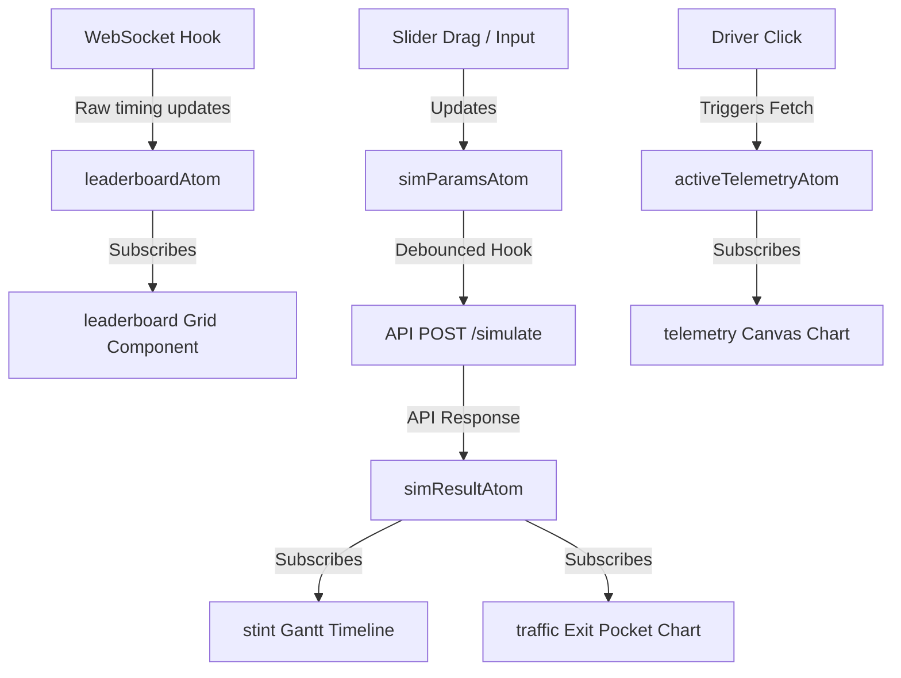

# FrontWing Frontend UI Architecture & State Flow

This document details the frontend architecture, system stack, real-time data cache synchronization, and state management flow for FrontWing.

---

## 1. System Technology Stack

The UI is built on a responsive, high-performance architecture optimized for processing and rendering high-frequency timing metrics:

1. **Framework**: React (TypeScript) bootstrapped with **Vite** for sub-second hot module reloading.
2. **Styling**: Vanilla CSS for core layout styling and design tokens, paired with TailwindCSS for responsive layouts.
3. **Accessibility (A11y)**: **Radix UI Primitives** (Dialog, Dropdown, Slider, Combobox) to handle keyboard controls and screen reader standards.
4. **State Management**: **Jotai** for atomic, decentralized state. Jotai's fine-grained reactivity prevents full-grid timing updates from triggering unnecessary re-renders of adjacent panels (e.g., chat consoles).
5. **Data Visualization**:
   - **HTML5 Canvas**: Dedicated CPU/GPU rendering layer for drawing downsampled speed/throttle speed traces (essential for high scroll/zoom performance).
   - **SVG Vectors**: Used for coordinate track maps, radial scoring polygons, and responsive stint timelines where interactive hit-testing is needed.

---

## 2. Real-Time Data Inflow & Cache Layout

Telemetry data follows a low-latency, unidirectional flow to prevent performance bottlenecks:

```text
 ┌──────────────────────┐
 │  F1 Timing/Telemetry │
 └──────────┬───────────┘
            │
            ▼ (Live Stream 2-10Hz)
 ┌──────────────────────┐
 │ Python Ingestion     │
 └──────────┬───────────┘
            │
            ▼ (Redis XADD Stream)
 ┌──────────────────────┐
 │ Redis Hot Cache      │
 └──────────┬───────────┘
            │
            ▼ (Redis Pub/Sub Channel)
 ┌──────────────────────┐
 │ Node.js Gateway      │
 └──────────┬───────────┘
            │
            ▼ (WebSockets Protocol)
 ┌──────────────────────┐
 │ Client browser hook  │
 └──────────────────────┘
```

1. **Caching & Buffering**: Live car telemetry signals are written directly to Redis streams (`XADD`). Node.js gateway acts as a pipeline subscriber, distributing timing deltas to client sockets without querying PostgreSQL transactional disks.
2. **LTTB Downsampling**: When loading historical timelines, the FastAPI service downsamples lap arrays (e.g., 70,000 telemetry points) to a maximum of 1,000 points using the Largest-Triangle-Three-Buckets (LTTB) algorithm before JSON serialization, reducing network payload sizes by **98.5%**.

---

## 3. UI State Flow & Jotai Atoms

State is divided into atomic nodes to ensure that UI components only update when their specific slice of data changes.



### Core Atom Definitions (Jotai)

1. **`leaderboardAtom`**:
   - *Type*: `Atom<Record<string, DriverTimingRecord>>`
   - *Purpose*: Stores the current lap, position, gap to leader, and compound age for all active cars. Updated directly from WebSocket frames.
2. **`activeTelemetryAtom`**:
   - *Type*: `Atom<{ driverA: TelemetryPoint[], driverB: TelemetryPoint[] } | null>`
   - *Purpose*: Caches the LTTB-downsampled telemetry arrays for comparison overlays in the Ghost Battle panel.
3. **`simParamsAtom`**:
   - *Type*: `Atom<{ session_id: string, driver_id: string, pit_lap: number, compound: string }>`
   - *Purpose*: Tracks current inputs for the strategy projection query.
4. **`simResultAtom`**:
   - *Type*: `Atom<SimulationResults | null>`
   - *Purpose*: Stores simulated lap timelines and re-entry traffic positions. Subscribed to by the Gantt stint timeline and traffic visualization charts.

---

## 4. Performance Safeguards

1. **Canvas Double-Buffering**: Telemetry canvas rendering is drawn to a background canvas before being copied to the screen to prevent flickering during zoom/drag operations.
2. **Dynamic Downsampling Rates**: If the user zooms in on a specific sector in a telemetry speed trace, a debounced query fetches higher-density timing coordinates only for that coordinate subset.
3. **RequestAnimationFrame Timing**: All real-time timing table modifications are scheduled using `requestAnimationFrame` to prevent UI lags during frame renders.
